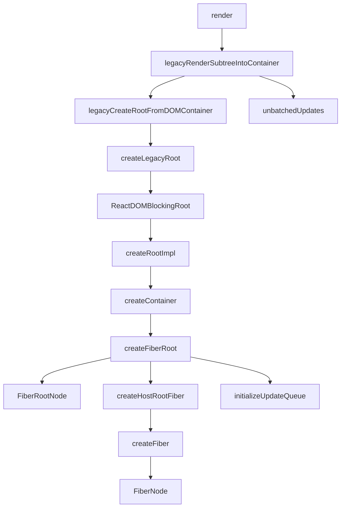
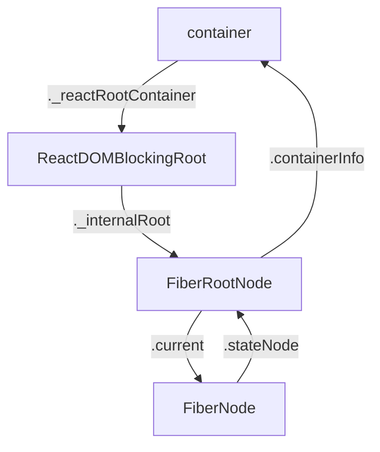

从React Element的构建开始。


<!-- more -->




|  函数名     |   参数(类型)    |   位置    |
|  ---  |  ---  |  ---  |
|  render     |    element(React$Element)、container(Container)、callback(Function)   |  react-dom/src/client/ReactDOMLegacy     |
|  legacyRenderSubtreeIntoContainer     |  parentComponnet(React$Component)、 children(ReactNodeList)、 container(Container)、 forceHydrate(boolean)、 callback(Function)     | react-dom/src/client/ReactDOMLegacy      |
|  legacyCreateRootFromDOMContainer     |  container(Container)、 forceHydrate(boolean)     |  react-dom/src/client/ReactDOMLegacy     |
|  createLegacyRoot     |  container(Container)、 options(RootOptions)     |   react-dom/src/client/ReactDOMRoot    |
|  ReactDOMBlockingRoot     |  container(Container)、 tag(RootTag)、 options(void或RootOptions)     |  react-dom/src/client/ReactDOMRoot     |
|  createRootImpl     |  container(Container)、 tag(RootTag)、 options(void或RootOptions)     |   react-dom/src/client/ReactDOMRoot    |
|  createContainer     | containerInfo(Container)、 tag(RootTag)、 hydrate(boolean)、 hydrationCallbacks(null或SuspenseHydrationCallbacks)      | react-reconciler/src/ReactFiberReconciler      |
|  createFiberRoot     | containerInfo(any)、 tag(RootTag)、 hydrate(boolean)、 hydrationCallbacks(null或SuspenseHydrationCallbacks)      |   react-reconciler/src/ReactFiberRoot    |
|  FiberRootNode     |  containerInfo、 tag、 hydrate（与上面相同）     |   react-reconciler/src/ReactFiberRoot    |
|  createHostRootFiber     |   tag(RootTag)    |   react-reconciler/src/ReactFiber    |
|  createFiber     |   tag(WorkTag)、 pendingProps(mixed)、 key(null或string)、 mode(TypeOfMOde)    |   react-reconciler/src/ReactFiber    |
|  FiberNode     |   tag、 pendingProps、 key、 mode(与上面相同)    |   react-reconciler/src/ReactFiber    |
|  initializeUpdateQueue     |   fiber(Fiber)    |   react-reconciler/src/ReactUpdateQueue    |
|  markContainerAsRoot     |   hostRoot(Fiber)、 node(Container)    |   react-dom/src/client/ReactDOMComponentTree    |
|  unbatchedUpdates     |   fn(Function)    |   react-reconciler/src/ReactFiberWorkLoop    |
|  updateContainer     |   element(ReactNodelist)、container(OpaqueRoot)、parentComponent(React$Component)、callback(Function)    |   react-reconciler/src/ReactFiberReconciler    |




---

### 函数调用

1. render

render中是这样调用ledacyRenderSubtreeIntoContainer的：

```js
legacyRenderSubtreeIntoContainer(
  null,
  element,
  container,
  false,
  callback,
);
```

2. legacyRenderSubtreeIntoContainer
  - 创建root
  - 和更新相关

  简化代码如下：
  ```js
    function legacyRenderSubtreeIntoContainer(
    parentComponent,
    children,
    container,
    forceHydrate,
    callback
    ) {
      let root: RootType = (container._reactRootContainer: any);
      let fiberRoot;
      if (!root) {
        // Initial mount
        debugger;
        root = container._reactRootContainer = legacyCreateRootFromDOMContainer(
          container,
          forceHydrate,
        );
        fiberRoot = root._internalRoot;
        if (typeof callback === 'function') {
          const originalCallback = callback;
          callback = function() {
            const instance = getPublicRootInstance(fiberRoot);
            originalCallback.call(instance);
          };
        }
        // Initial mount should not be batched.
        unbatchedUpdates(() => {
          updateContainer(children, fiberRoot, parentComponent, callback);
        });
      } else {
        fiberRoot = root._internalRoot;
        if (typeof callback === 'function') {
          const originalCallback = callback;
          callback = function() {
            const instance = getPublicRootInstance(fiberRoot);
            originalCallback.call(instance);
          };
        }
        // Update
        updateContainer(children, fiberRoot, parentComponent, callback);
      }
      return getPublicRootInstance(fiberRoot);
    }
  ```

3. legacyCreateRootFromDOMContainer

  创建root的调用：`legacyCreateRootFromDOMContainer(container, false)`

4. createLegacyRoot

  这个函数返回ReactDOMBlockingRoot的一个实例

  此处的调用：`createLegacyRoot(container, undefined)`

5. ReactDOMBlockingRoot

  这个构造函数有一个实例属性：`_internalRoot`，属性值是createRootImpl函数的返回值

  此处调用：`new ReactDOMBlockingRoot(container, 0, undefined)`

6. createRootImpl

  简化代码如下：

  ```js
      function createRootImpl(
      container,
      tag,
      options
    ) {
      // Tag is either LegacyRoot or Concurrent Root
      const hydrate = options != null && options.hydrate === true;
      const hydrationCallbacks =
        (options != null && options.hydrationOptions) || null;
      const mutableSources =
        (options != null &&
          options.hydrationOptions != null &&
          options.hydrationOptions.mutableSources) ||
        null;
      const root = createContainer(container, tag, hydrate, hydrationCallbacks);
      markContainerAsRoot(root.current, container);
      const containerNodeType = container.nodeType;

      if (hydrate && tag !== LegacyRoot) {
        const doc =
          containerNodeType === DOCUMENT_NODE ? container : container.ownerDocument;
        // We need to cast this because Flow doesn't work
        // with the hoisted containerNodeType. If we inline
        // it, then Flow doesn't complain. We intentionally
        // hoist it to reduce code-size.
        eagerlyTrapReplayableEvents(container, ((doc: any): Document));
      } else if (
        enableModernEventSystem &&
        containerNodeType !== DOCUMENT_FRAGMENT_NODE &&
        containerNodeType !== DOCUMENT_NODE
      ) {
        ensureListeningTo(container, 'onMouseEnter');
      }

      if (mutableSources) {
        for (let i = 0; i < mutableSources.length; i++) {
          const mutableSource = mutableSources[i];
          registerMutableSourceForHydration(root, mutableSource);
        }
      }

      return root;
    }
  ```

  这个函数第二参数接受一个tag，用来标明root的类型，在首次加载时，传入的值是`LegacyRoot(0)`，定义在`react-reconciler/src/ReactRootTags`中。

  此处调用： `createRootImpl(container, LegacyRoot, undefined)`

  函数内部的root变量是一个FiberRootNode实例，它的current属性指向FiberNode实例

  首次渲染的时候，中间的过程都会跨过，直接到最后的返回root，成为ReactDOMBlockingRoot实例的_internalRoot的属性值，然后ReactDOMBlockingRoot实例一路返回到legacyRenderSubtreeIntoContainer函数赋值给root变量

7. createContainer

  此处调用：`createContainer(container, LegacyRoot, false, null)`

  直接调用createFiberRoot

8. createFiberRoot

  此处调用：`createFiberRoot(container, LegacyRoot, false, null)`

  简化代码如下：

  ```js
    function createFiberRoot(
      containerInfo,
      tag,
      hydrate,
      hydrationCallbacks
    ) {
      const root = new FiberRootNode(containerInfo, tag, hydrate);
      if (enableSuspenseCallback) {
        root.hydrationCallbacks = hydrationCallbacks;
      }

      // Cyclic construction. This cheats the type system right now because
      // stateNode is any.
      const uninitializedFiber = createHostRootFiber(tag);
      root.current = uninitializedFiber;
      uninitializedFiber.stateNode = root;

      initializeUpdateQueue(uninitializedFiber);

      return root;
    }
  ```

  函数中uninitializedFiber变量的值是一个FiberNode的实例，这个实例被赋值给了FiberRootNode实例的current属性

  而FiberNode的实例的stateNode的属性值是FiberRootNode实例

  也就是说这两个实例通过各自的属性实现了相互引用

9. FiberRootNode

  用于实例化一个*FiberRootNode*对象

  此处调用：`new FiberRootNode(container, LegacyRoot, false)`

10. createHostRootFiber

  函数内变量mode取值范围来自：`react-reconciler/src/ReactTypeOfMode`，首次渲染mode取值NoMode，值为：0b00000，使用二进制数表示

  函数内使用的HostRoot来自：`react-reconciler/src/ReactWorkTags`，值为3

  此处调用：`createHostRootFiber(LegacyRoot)`

11. createFiber
  
  直接调用

  此处调用：`createFiber(HostRoot, null, null, ob00000)`

12. FiberNode

  用于实例化一个*FiberNode*对象，创建完成后，会经过createFiber，createHostRootFiber回到createFiberRoot，

  此处调用：`new FiberNode(LegacyRoot, null, null, NoMode)`

  那么问题就来了，FiberRootNode和FiberNode有什么区别？

13. initializeUpdateQueue

  这个函数给FiberNode的实例添加了一个updateQueue属性，属性值包括： 

  ```js
    // fiber是一个FiberNode实例
    {
      baseState: fiber.memoizedState,
      firstBaseUpdate: null,
      lastBaseUpdate: null,
      shared: {
        pending: null,
      },
      effects: null,
    }
  ```

  那么问题就来了，为何不在实例化FiberNode的时候创建这个updateQueue属性？

  此处调用：`initializeUpdateQueue(new FiberNode(LegacyRoot, null, null, NoMode))`


14. markContainerAsRoot

  这个函数给container对象，也就是dom对象添加了一个internalContainerInstanceKey属性，属性值是其对应的FiberNode实例

15. unbatchedUpdates
  
  这个函数内部代码描述见[参考3](https://segmentfault.com/q/1010000019803174)
  简化后的代码如下：

  ```js
    // NoContext = 0b0000000
    // BatchedContext = 0b0000001
    // LegacyUnbatchedContext = 0b0001000

    function unbatchedUpdates(fn, a) {
      const prevExecutionContext = executionContext;
      executionContext &= ~BatchedContext;
      executionContext |= LegacyUnbatchedContext;
      try {
        return fn(a);
      } finally {
        executionContext = prevExecutionContext;
        if (executionContext === NoContext) {
          // Flush the immediate callbacks that were scheduled during this batch
          flushSyncCallbackQueue();
        }
      }
    }
  ```
  进入try代码块代码的执行顺序：
  1. 执行fn(a)
  2. 执行finally中的内容
  3. 返回fn(a)的执行结果

  executionContext这个变量记录了当前在执行栈中的位置，变换规则（见[参考4](https://juejin.im/post/5dd3bebbe51d453da86c1185#heading-11)）：
  - 将当前上下文添加 render：executionContext |= RenderContext
  - 判断当前是否处于 render 阶段： executionContext &= RenderContext === NoContext
  - 去除 render: executionContext &= ~RenderContext

  这里先去除BatchedContext状态，又置为LegacyUnbatchedContext盲猜是为其他地方运行的代码设置执行环境，防止出现某些问题，也就是说执行fn的时候可能会和这个地方有关联。。。
---

### JSX转React Element

下面这段JSX：

```js
  function App() {
    return (
      <div className="App">
        <header className="App-header">
          
          <p>
            Edit <code>src/App.js</code> and save to reload.
          </p>
          <a
            className="App-link"
            href="https://reactjs.org"
            target="_blank"
            rel="noopener noreferrer"
          >
            test
          </a>
        </header>
      </div>
    );
  }
```

转换为React Element为：

```js
function App() {
  return React.createElement("div", {
    className: "App"
  }, React.createElement("header", {
    className: "App-header"
  }, React.createElement("img", {
    src: logo,
    className: "App-logo",
    alt: "logo"
  }), React.createElement("p", null, "Edit ", React.createElement("code", null, "src/App.js"), " and save to reload."), React.createElement("a", {
    className: "App-link",
    href: "https://reactjs.org",
    target: "_blank",
    rel: "noopener noreferrer"
  }, "test")));
}
```

---

### createElement

createElement(type, config, children)函数位于： `src/react/packages/react/src/ReactElement.js`。

JSX转换之后会调用这个方法，这个函数内部也是先后处理这三个参数，将处理后的参数传入`ReactElement()`函数中，创建React Element。

---

### ReactElement

ReactElement(type, key, ref, self, source, owner, props)位于： `src/react/packages/react/src/ReactElement.js`。

执行结果返回一个普通js对象，包含下面的参数：

```js
  const element = {
    // This tag allows us to uniquely identify this as a React Element
    $$typeof: REACT_ELEMENT_TYPE,

    // Built-in properties that belong on the element
    type: type,
    key: key,
    ref: ref,
    props: props,

    // Record the component responsible for creating this element.
    _owner: owner,
  };
```

`$$typeof`属性值是一个Symbol类型，[参考1](https://overreacted.io/why-do-react-elements-have-typeof-property/)中描述了`$$typeof`存在的意义。

比如服务器存在一个漏洞，可以接受任意的json，前端代码某处需要的是一个字符串，如果后端返回一个恶意的React Element，就有可能注入到前端。Symbol类型的一个特点是不能通过Json进行传递，所以react内部会检查每一个React Element的`$$typeof`属性，保证合法性。

react使用`Symbol.for`这个api在全局池中进行这种类型的创建，特点详见[参考2](https://developer.mozilla.org/en-US/docs/Web/JavaScript/Reference/Global_Objects/Symbol/for)。

react中Symbol类型的定义位于：`/src/react/packages/shared/ReactSymbols.js`。

---

### 参考资料

1. https://overreacted.io/why-do-react-elements-have-typeof-property/
2. https://developer.mozilla.org/en-US/docs/Web/JavaScript/Reference/Global_Objects/Symbol/for
3. https://segmentfault.com/q/1010000019803174
4. https://juejin.im/post/5dd3bebbe51d453da86c1185#heading-11