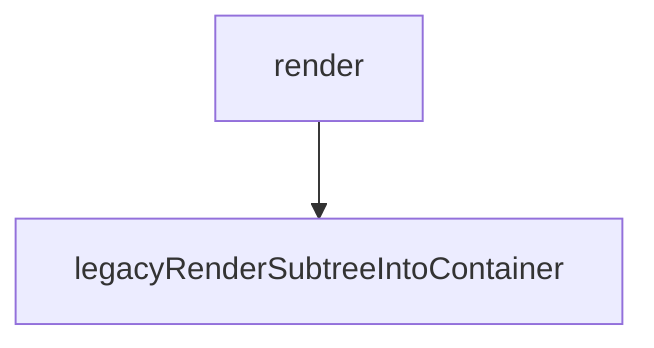

从React Element的构建开始。



<!-- more -->

---

### 函数调用

1. render

参数：element, container, callback

位置：react-dom/src/client/ReactDOMLegacy

2. legacyRenderSubtreeIntoContainer

参数：parentComponnet, children, container, forceHydrate, callback

位置：react-dom/src/client/ReactDOMLegacy

---

### JSX转React Element

下面这段JSX：

```js
  function App() {
    return (
      <div className="App">
        <header className="App-header">
          
          <p>
            Edit <code>src/App.js</code> and save to reload.
          </p>
          <a
            className="App-link"
            href="https://reactjs.org"
            target="_blank"
            rel="noopener noreferrer"
          >
            test
          </a>
        </header>
      </div>
    );
  }
```

转换为React Element为：

```js
function App() {
  return React.createElement("div", {
    className: "App"
  }, React.createElement("header", {
    className: "App-header"
  }, React.createElement("img", {
    src: logo,
    className: "App-logo",
    alt: "logo"
  }), React.createElement("p", null, "Edit ", React.createElement("code", null, "src/App.js"), " and save to reload."), React.createElement("a", {
    className: "App-link",
    href: "https://reactjs.org",
    target: "_blank",
    rel: "noopener noreferrer"
  }, "test")));
}
```

---

### createElement

createElement(type, config, children)函数位于： `src/react/packages/react/src/ReactElement.js`。

JSX转换之后会调用这个方法，这个函数内部也是先后处理这三个参数，将处理后的参数传入`ReactElement()`函数中，创建React Element。

---

### ReactElement

ReactElement(type, key, ref, self, source, owner, props)位于： `src/react/packages/react/src/ReactElement.js`。

执行结果返回一个普通js对象，包含下面的参数：

```js
  const element = {
    // This tag allows us to uniquely identify this as a React Element
    $$typeof: REACT_ELEMENT_TYPE,

    // Built-in properties that belong on the element
    type: type,
    key: key,
    ref: ref,
    props: props,

    // Record the component responsible for creating this element.
    _owner: owner,
  };
```

`$$typeof`属性值是一个Symbol类型，[参考1](https://overreacted.io/why-do-react-elements-have-typeof-property/)中描述了`$$typeof`存在的意义。

比如服务器存在一个漏洞，可以接受任意的json，前端代码某处需要的是一个字符串，如果后端返回一个恶意的React Element，就有可能注入到前端。Symbol类型的一个特点是不能通过Json进行传递，所以react内部会检查每一个React Element的`$$typeof`属性，保证合法性。

react使用`Symbol.for`这个api在全局池中进行这种类型的创建，特点详见[参考2](https://developer.mozilla.org/en-US/docs/Web/JavaScript/Reference/Global_Objects/Symbol/for)。

react中Symbol类型的定义位于：`/src/react/packages/shared/ReactSymbols.js`。

---

### 参考资料

1. https://overreacted.io/why-do-react-elements-have-typeof-property/
2. https://developer.mozilla.org/en-US/docs/Web/JavaScript/Reference/Global_Objects/Symbol/for