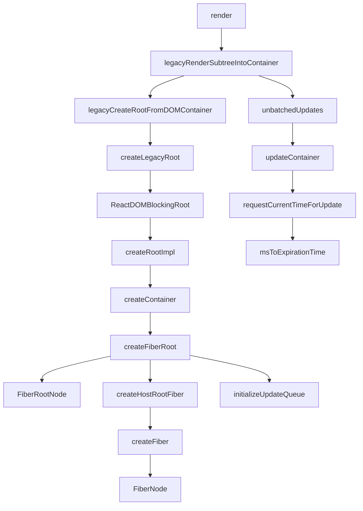
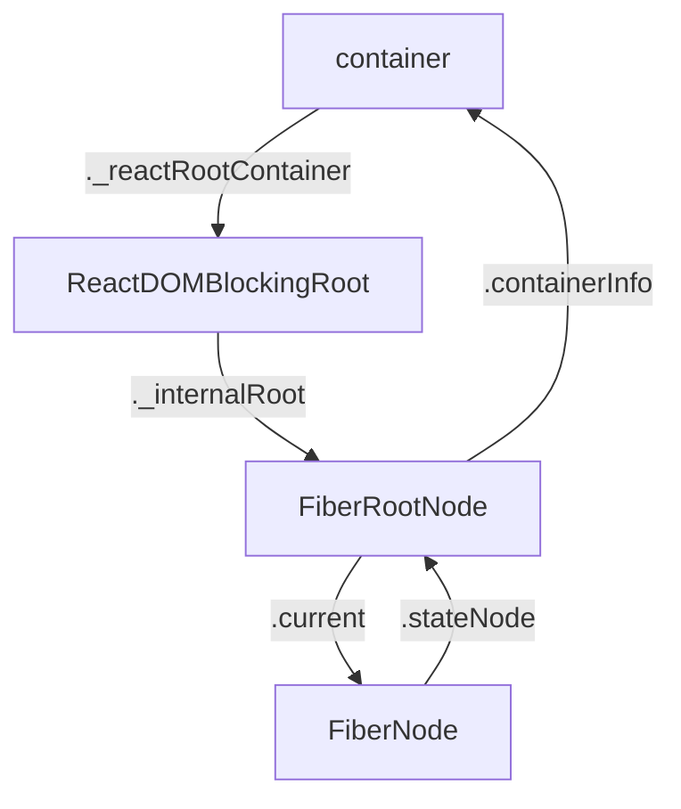

在React Element的构建完成之后，就会开始构建React内部数据结构及更新，主要过程发生在`legacyRenderSubtreeIntoContainer`函数中，详见下图。

这一部分主要学习数据结构的构建(下图左侧的部分)。


<!-- more -->




|  函数名     |   参数(类型)    |   位置    |
|  ---  |  ---  |  ---  |
|  render     |    element(React$Element)、container(Container)、callback(Function)   |  react-dom/src/client/ReactDOMLegacy     |
|  legacyRenderSubtreeIntoContainer     |  parentComponnet(React$Component)、 children(ReactNodeList)、 container(Container)、 forceHydrate(boolean)、 callback(Function)     | react-dom/src/client/ReactDOMLegacy      |
|  legacyCreateRootFromDOMContainer     |  container(Container)、 forceHydrate(boolean)     |  react-dom/src/client/ReactDOMLegacy     |
|  createLegacyRoot     |  container(Container)、 options(RootOptions)     |   react-dom/src/client/ReactDOMRoot    |
|  ReactDOMBlockingRoot     |  container(Container)、 tag(RootTag)、 options(void或RootOptions)     |  react-dom/src/client/ReactDOMRoot     |
|  createRootImpl     |  container(Container)、 tag(RootTag)、 options(void或RootOptions)     |   react-dom/src/client/ReactDOMRoot    |
|  createContainer     | containerInfo(Container)、 tag(RootTag)、 hydrate(boolean)、 hydrationCallbacks(null或SuspenseHydrationCallbacks)      | react-reconciler/src/ReactFiberReconciler      |
|  createFiberRoot     | containerInfo(any)、 tag(RootTag)、 hydrate(boolean)、 hydrationCallbacks(null或SuspenseHydrationCallbacks)      |   react-reconciler/src/ReactFiberRoot    |
|  FiberRootNode     |  containerInfo、 tag、 hydrate（与上面相同）     |   react-reconciler/src/ReactFiberRoot    |
|  createHostRootFiber     |   tag(RootTag)    |   react-reconciler/src/ReactFiber    |
|  createFiber     |   tag(WorkTag)、 pendingProps(mixed)、 key(null或string)、 mode(TypeOfMOde)    |   react-reconciler/src/ReactFiber    |
|  FiberNode     |   tag、 pendingProps、 key、 mode(与上面相同)    |   react-reconciler/src/ReactFiber    |
|  initializeUpdateQueue     |   fiber(Fiber)    |   react-reconciler/src/ReactUpdateQueue    |
|  markContainerAsRoot     |   hostRoot(Fiber)、 node(Container)    |   react-dom/src/client/ReactDOMComponentTree    |


---

### 函数调用

1. render

render中是这样调用ledacyRenderSubtreeIntoContainer的：

```js
legacyRenderSubtreeIntoContainer(
  null,
  element,
  container,
  false,
  callback,
);
```

2. legacyRenderSubtreeIntoContainer
  - 创建root
  - 和更新相关

  简化代码如下：
  ```js
    function legacyRenderSubtreeIntoContainer(
    parentComponent,
    children,
    container,
    forceHydrate,
    callback
    ) {
      let root: RootType = (container._reactRootContainer: any);
      let fiberRoot;
      if (!root) {
        // Initial mount
        debugger;
        root = container._reactRootContainer = legacyCreateRootFromDOMContainer(
          container,
          forceHydrate,
        );
        fiberRoot = root._internalRoot;
        if (typeof callback === 'function') {
          const originalCallback = callback;
          callback = function() {
            const instance = getPublicRootInstance(fiberRoot);
            originalCallback.call(instance);
          };
        }
        // Initial mount should not be batched.
        unbatchedUpdates(() => {
          updateContainer(children, fiberRoot, parentComponent, callback);
        });
      } else {
        fiberRoot = root._internalRoot;
        if (typeof callback === 'function') {
          const originalCallback = callback;
          callback = function() {
            const instance = getPublicRootInstance(fiberRoot);
            originalCallback.call(instance);
          };
        }
        // Update
        updateContainer(children, fiberRoot, parentComponent, callback);
      }
      return getPublicRootInstance(fiberRoot);
    }
  ```

3. legacyCreateRootFromDOMContainer

  创建root的调用：`legacyCreateRootFromDOMContainer(container, false)`

4. createLegacyRoot

  这个函数返回ReactDOMBlockingRoot的一个实例

  此处的调用：`createLegacyRoot(container, undefined)`

5. ReactDOMBlockingRoot

  这个构造函数有一个实例属性：`_internalRoot`，属性值是createRootImpl函数的返回值

  此处调用：`new ReactDOMBlockingRoot(container, 0, undefined)`

6. createRootImpl

  简化代码如下：

  ```js
      function createRootImpl(
      container,
      tag,
      options
    ) {
      // Tag is either LegacyRoot or Concurrent Root
      const hydrate = options != null && options.hydrate === true;
      const hydrationCallbacks =
        (options != null && options.hydrationOptions) || null;
      const mutableSources =
        (options != null &&
          options.hydrationOptions != null &&
          options.hydrationOptions.mutableSources) ||
        null;
      const root = createContainer(container, tag, hydrate, hydrationCallbacks);
      markContainerAsRoot(root.current, container);
      const containerNodeType = container.nodeType;

      if (hydrate && tag !== LegacyRoot) {
        const doc =
          containerNodeType === DOCUMENT_NODE ? container : container.ownerDocument;
        // We need to cast this because Flow doesn't work
        // with the hoisted containerNodeType. If we inline
        // it, then Flow doesn't complain. We intentionally
        // hoist it to reduce code-size.
        eagerlyTrapReplayableEvents(container, ((doc: any): Document));
      } else if (
        enableModernEventSystem &&
        containerNodeType !== DOCUMENT_FRAGMENT_NODE &&
        containerNodeType !== DOCUMENT_NODE
      ) {
        ensureListeningTo(container, 'onMouseEnter');
      }

      if (mutableSources) {
        for (let i = 0; i < mutableSources.length; i++) {
          const mutableSource = mutableSources[i];
          registerMutableSourceForHydration(root, mutableSource);
        }
      }

      return root;
    }
  ```

  这个函数第二参数接受一个tag，用来标明root的类型，在首次加载时，传入的值是`LegacyRoot(0)`，定义在`react-reconciler/src/ReactRootTags`中。

  此处调用： `createRootImpl(container, LegacyRoot, undefined)`

  函数内部的root变量是一个FiberRootNode实例，它的current属性指向FiberNode实例

  首次渲染的时候，中间的过程都会跨过，直接到最后的返回root，成为ReactDOMBlockingRoot实例的_internalRoot的属性值，然后ReactDOMBlockingRoot实例一路返回到legacyRenderSubtreeIntoContainer函数赋值给root变量

7. createContainer

  此处调用：`createContainer(container, LegacyRoot, false, null)`

  直接调用createFiberRoot

8. createFiberRoot

  此处调用：`createFiberRoot(container, LegacyRoot, false, null)`

  简化代码如下：

  ```js
    function createFiberRoot(
      containerInfo,
      tag,
      hydrate,
      hydrationCallbacks
    ) {
      const root = new FiberRootNode(containerInfo, tag, hydrate);
      if (enableSuspenseCallback) {
        root.hydrationCallbacks = hydrationCallbacks;
      }

      // Cyclic construction. This cheats the type system right now because
      // stateNode is any.
      const uninitializedFiber = createHostRootFiber(tag);
      root.current = uninitializedFiber;
      uninitializedFiber.stateNode = root;

      initializeUpdateQueue(uninitializedFiber);

      return root;
    }
  ```

  函数中uninitializedFiber变量的值是一个FiberNode的实例，这个实例被赋值给了FiberRootNode实例的current属性

  而FiberNode的实例的stateNode的属性值是FiberRootNode实例

  也就是说这两个实例通过各自的属性实现了相互引用

9. FiberRootNode

  用于实例化一个*FiberRootNode*对象

  此处调用：`new FiberRootNode(container, LegacyRoot, false)`

  ```js
    function FiberRootNode(containerInfo, tag, hydrate) {
      this.tag = tag;
      this.current = null;
      this.containerInfo = containerInfo;
      this.pendingChildren = null;
      this.pingCache = null;
      this.finishedExpirationTime = NoWork;
      this.finishedWork = null;
      this.timeoutHandle = noTimeout;
      this.context = null;
      this.pendingContext = null;
      this.hydrate = hydrate;
      this.callbackNode = null;
      this.callbackPriority_old = NoPriority;
      this.firstPendingTime = NoWork;
      this.lastPendingTime = NoWork;
      this.firstSuspendedTime = NoWork;
      this.lastSuspendedTime = NoWork;
      this.nextKnownPendingLevel = NoWork;
      this.lastPingedTime = NoWork;
      this.lastExpiredTime = NoWork;
      this.mutableSourceLastPendingUpdateTime = NoWork;

      if (supportsHydration) {
        this.mutableSourceEagerHydrationData = null;
      }

      if (enableSchedulerTracing) {
        this.interactionThreadID = unstable_getThreadID();
        this.memoizedInteractions = new Set();
        this.pendingInteractionMap_old = new Map();
      }
      if (enableSuspenseCallback) {
        this.hydrationCallbacks = null;
      }
    }
  ```

10. createHostRootFiber

  函数内变量mode取值范围来自：`react-reconciler/src/ReactTypeOfMode`，首次渲染mode取值NoMode，值为：0b00000，使用二进制数表示

  函数内使用的HostRoot来自：`react-reconciler/src/ReactWorkTags`，值为3

  此处调用：`createHostRootFiber(LegacyRoot)`

11. createFiber
  
  直接调用

  此处调用：`createFiber(HostRoot, null, null, ob00000)`

12. FiberNode

  用于实例化一个*FiberNode*对象，创建完成后，会经过createFiber，createHostRootFiber回到createFiberRoot，

  此处调用：`new FiberNode(LegacyRoot, null, null, NoMode)`

  ```js
  function FiberNode(
    tag: WorkTag,
    pendingProps: mixed,
    key: null | string,
    mode: TypeOfMode,
  ) {
    // Instance
    this.tag = tag;
    this.key = key;
    this.elementType = null;
    this.type = null;
    this.stateNode = null;

    // Fiber
    this.return = null;
    this.child = null;
    this.sibling = null;
    this.index = 0;

    this.ref = null;

    this.pendingProps = pendingProps;
    this.memoizedProps = null;
    this.updateQueue = null;
    this.memoizedState = null;
    this.dependencies_old = null;

    this.mode = mode;

    // Effects
    this.effectTag = NoEffect;
    this.nextEffect = null;

    this.firstEffect = null;
    this.lastEffect = null;

    this.expirationTime = NoWork;
    this.childExpirationTime = NoWork;

    this.alternate = null;

    if (enableProfilerTimer) {
      // Note: The following is done to avoid a v8 performance cliff.
      //
      // Initializing the fields below to smis and later updating them with
      // double values will cause Fibers to end up having separate shapes.
      // This behavior/bug has something to do with Object.preventExtension().
      // Fortunately this only impacts DEV builds.
      // Unfortunately it makes React unusably slow for some applications.
      // To work around this, initialize the fields below with doubles.
      //
      // Learn more about this here:
      // https://github.com/facebook/react/issues/14365
      // https://bugs.chromium.org/p/v8/issues/detail?id=8538
      this.actualDuration = Number.NaN;
      this.actualStartTime = Number.NaN;
      this.selfBaseDuration = Number.NaN;
      this.treeBaseDuration = Number.NaN;

      // It's okay to replace the initial doubles with smis after initialization.
      // This won't trigger the performance cliff mentioned above,
      // and it simplifies other profiler code (including DevTools).
      this.actualDuration = 0;
      this.actualStartTime = -1;
      this.selfBaseDuration = 0;
      this.treeBaseDuration = 0;
    }
  }
  ```

13. initializeUpdateQueue

  这个函数给FiberNode的实例添加了一个updateQueue属性，属性值包括： 

  ```js
    // fiber是一个FiberNode实例
    {
      baseState: fiber.memoizedState,
      firstBaseUpdate: null,
      lastBaseUpdate: null,
      shared: {
        pending: null,
      },
      effects: null,
    }
  ```

  那么问题就来了，为何不在实例化FiberNode的时候创建这个updateQueue属性？

  此处调用：`initializeUpdateQueue(new FiberNode(LegacyRoot, null, null, NoMode))`


14. markContainerAsRoot

  这个函数给container对象，也就是dom对象添加了一个internalContainerInstanceKey属性，属性值是其对应的FiberNode实例


### 主要数据结构

通过上面的函数调用，会构建出下面的数据结构：



[参考1](https://juejin.im/post/5dd3bebbe51d453da86c1185#heading-0)中有对Fiber的简单描述，Fiber是线程的颗粒化，也就是说一个线程可以包含多个 Fiber，可以使同步计算变得被拆解、异步化，使浏览器主线程得以调控。

上面的数据结构中，

1. FiberNode是Fiber的构造函数，用来创建不同类型的Fiber。首次渲染时，container对应的是HostRoot类型的Fiber，被称作rootFiber，是FiberTree的根节点，充当最顶层组件的父集
2. FiberRootNode是fiberRoot的构造函数

关于fiberRoot和rootFiber的关系，目前只能参考他人的理解，详见[参考2](https://github.com/lz-lee/React-Source-Code/issues/2)。

  FiberRoot

  - 整个应用的起点
  - 包含应用挂载的目标节点
  - 记录整个应用更新过程的各种信息


  Fiber(RootFiber作用已在上面描述，本质是Fiber，是container对应的Fiber)

  - 每一个 ReactElement 对应一个 Fiber 对象
  - 记录节点的各种状态
  - 串联整个应用形成树形结构

---

### 参考资料

1. https://juejin.im/post/5dd3bebbe51d453da86c1185#heading-0
2. https://github.com/lz-lee/React-Source-Code/issues/2