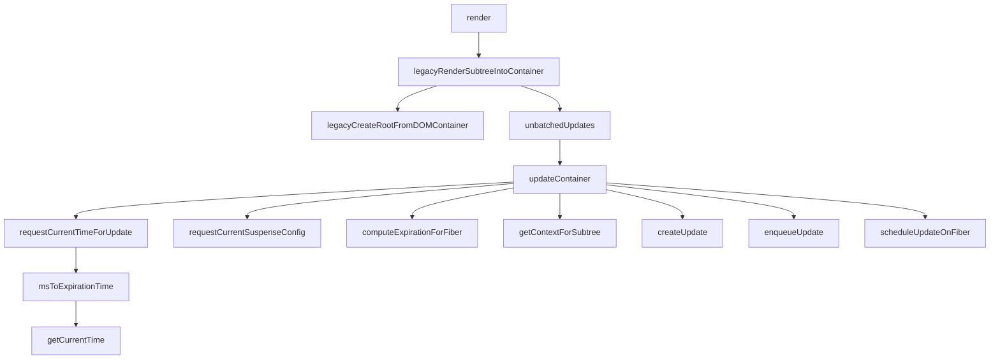
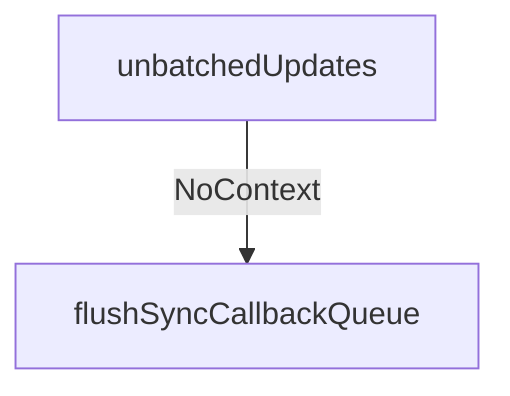
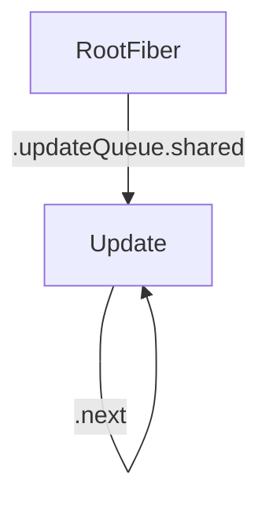

之前知道了首次渲染主要数据结构的构建过程，现在进入创建更新的过程（下图中的右侧部分）。

<!-- more -->





|  函数名     |   参数(类型)    |   位置    |
|  ---  |  ---  |  ---  |
|  unbatchedUpdates     |   fn(Function)    |   react-reconciler/src/ReactFiberWorkLoop    |
|  updateContainer     |   element(ReactNodelist)、container(OpaqueRoot)、parentComponent(React$Component)、callback(Function)    |   react-reconciler/src/ReactFiberReconciler    |
|  requestCurrentTimeForUpdate     |      |   react-reconciler/src/ReactFiberWorkLoop    |
|  msToExpirationTime     |   ms(number)   |   react-reconciler/src/ReactFiberExpirationTime    |
|getCurrentTime|-|scheduler/src/forks/SchedulerHostConfig.default|
|requestCurrentSuspenseConfig|-|react-reconciler/src/ReactFiberSuspenseConfig|
|computeExpirationForFiber|currentTime(ExpirationForFiber)、fiber、suspenseConfig（null 或 SuspenseConfig）|react-reconciler/src/ReactFiberWorkLoop|
|getContextForSubtree|parentComponent(ReactComponent)|react-reconciler/src/ReactFiberReconciler|
|createUpdate|expirationTime(ExpirationTime)、suspenseConfig(null 或 SuspenseConfig)|react-reconciler/src/ReactUpdateQueue|
|enqueueUpdate|fiber(Fiber)、update(Update)|react-reconciler/src/ReactUpdateQueue|

---

### 函数调用

1. unbatchedUpdates
  
  这个函数内部代码描述见[参考1](https://segmentfault.com/q/1010000019803174)
  简化后的代码如下：

  ```js
    // const NoContext = 0b0000000;
    // const BatchedContext = 0b0000001;
    // const EventContext = 0b0000010;
    // const DiscreteEventContext = 0b0000100;
    // const LegacyUnbatchedContext = 0b0001000;
    // const RenderContext = 0b0010000;
    // const CommitContext = 0b0100000;
    // const RetryAfterError = 0b1000000;

    function unbatchedUpdates(fn, a) {
      const prevExecutionContext = executionContext;
      executionContext &= ~BatchedContext;
      executionContext |= LegacyUnbatchedContext;
      try {
        return fn(a);
      } finally {
        executionContext = prevExecutionContext;
        if (executionContext === NoContext) {
          // Flush the immediate callbacks that were scheduled during this batch
          flushSyncCallbackQueue();
        }
      }
    }
  ```
  进入try代码块代码的执行顺序：
  1. 执行fn(a)
  2. 执行finally中的内容
  3. 返回fn(a)的执行结果

  executionContext这个变量*Describes where we are in the React execution stack*，变换规则(见[参考2](https://juejin.im/post/5dd3bebbe51d453da86c1185#heading-11))：
  - 将当前上下文添加 render：executionContext |= RenderContext
  - 判断当前是否处于render(*感觉这里是否处于并不准确*因为可能添加了多个context，这个后面再来修补概念)： executionContext & RenderContext !== noContext
  - 去除 render: executionContext &= ~RenderContext

  这里先去除BatchedContext状态，又置为LegacyUnbatchedContext盲猜是为其他地方或是fn的执行设置环境，防止出现某些问题。。。

  另外这里涉及流程控制：
  1. 先执行fn(a)
  2. 再执行finally中的部分
  3. 最后返回fn(a)的执行结果



2.  updateContainer

此处调用：`updateContainer(children, fiberRoot, parentComponent, callback);`

简化后的代码如下：

```js
  function updateContainer(
    element,
    container,
    parentComponent,
    callback
  ) {
    const current = container.current; // 根节点对应的Fiber
    const currentTime = requestCurrentTimeForUpdate();
    const suspenseConfig = requestCurrentSuspenseConfig(); // 首次渲染时，该变量被赋值null
    const expirationTime = computeExpirationForFiber( // 首次渲染时，该变量被赋值 MAX_SIGNED_31_BIT_INT = 1073741823
      currentTime,
      current,
      suspenseConfig,
    ); 

    const context = getContextForSubtree(parentComponent); // 首次渲染时， 该变量被赋值{}
    if (container.context === null) { // container就是上一篇里创建的FiberRoot，是一个Fiber的实例，他的context属性被赋值{}，构造函数中并没有这个字段
      container.context = context;
    } else {
      container.pendingContext = context;
    }

    const update = createUpdate(expirationTime, suspenseConfig);
    // Caution: React DevTools currently depends on this property
    // being called "element".
    update.payload = {element}; // element 是经过jsx编译及reactElement函数处理过的ReactElement

    callback = callback === undefined ? null : callback;
    if (callback !== null) {
      update.callback = callback;
    }

    enqueueUpdate(current, update);
    scheduleUpdateOnFiber(current, expirationTime);

    return expirationTime;
  }
```
3. requestCurrentTimeForUpdate

简化后的代码如下：

```js
  // Expiration times are computed by adding to the current time (the start
  // time). However, if two updates are scheduled within the same event, we
  // should treat their start times as simultaneous, even if the actual clock
  // time has advanced between the first and second call.

  // In other words, because expiration times determine how updates are batched,
  // we want all updates of like priority that occur within the same event to
  // receive the same expiration time. Otherwise we get tearing.
  let currentEventTime: ExpirationTime = NoWork;

  function requestCurrentTimeForUpdate() {
    if ((executionContext & (RenderContext | CommitContext)) !== NoContext) {
      // We're inside React, so it's fine to read the actual time.
      return msToExpirationTime(now());
    }
    // We're not inside React, so we may be in the middle of a browser event.
    if (currentEventTime !== NoWork) {
      // Use the same start time for all updates until we enter React again.
      return currentEventTime;
    }
    // This is the first update since React yielded. Compute a new start time.
    currentEventTime = msToExpirationTime(now());
    return currentEventTime;
  }
```

首次加载前两个条件都会越过，直接到新建

4. msToExpirationTime

简化后的代码：

```js
  // Max 31 bit integer. The max integer size in V8 for 32-bit systems.
  // Math.pow(2, 30) - 1
  // 0b111111111111111111111111111111
  const MAX_SIGNED_31_BIT_INT = 1073741823;
  const Sync = MAX_SIGNED_31_BIT_INT;
  const Batched = Sync - 1;

  const UNIT_SIZE = 10;
  const MAGIC_NUMBER_OFFSET = Batched - 1;
  
  function msToExpirationTime(ms) {
    // Always subtract from the offset so that we don't clash with the magic number for NoWork.
    return MAGIC_NUMBER_OFFSET - ((ms / UNIT_SIZE) | 0);
  }
```

上面的公式中：

`|0`表示取整


5. now

```js
  if (
    typeof performance === 'object' &&
    typeof performance.now === 'function'
  ) {
    getCurrentTime = () => performance.now();
  } else {
    const initialTime = Date.now();
    getCurrentTime = () => Date.now() - initialTime;
  }
```
这里涉及到以前没有接触过的东西：

  1. time origin

  [参考3](https://developer.mozilla.org/en-US/docs/Web/API/DOMHighResTimeStamp#The_time_origin)

  在浏览器普通文档环境里，time origin的计算如下：

  >If the script's global object is a Window, the time origin is determined as follows:
  > - If the current Document is the first one loaded in the Window, the time origin is the time at which the browser context was created.
  > - If during the process of unloading the previous document which was loaded in the window, a confirmation dialog was displayed to let the user confirm whether or not to leave the previous page, the time origin is the time at which the user confirmed that navigating to the new page was acceptable.
  > - If neither of the above determines the time origin, then the time origin is the time at which the navigation responsible for creating the window's current Document took place.

  2. performance.now()返回的是调用时距离time origin的区间差值，双精度浮点数格式，详见[参考4](https://developer.mozilla.org/en-US/docs/Web/API/Performance/now)

至此，计算得到currentTime，回到updateContainer

6. requestCurrentSuspenseConfig

```js
  function requestCurrentSuspenseConfig(): null | SuspenseConfig {
    return ReactCurrentBatchConfig.suspense;
  }
```
首次渲染时，返回null，ReactCurrentBatchConfig.suspense的值获取的比较绕，用到SuspenseConfig情况时再说。


7. computeExpirationForFiber

```js

  export const NoMode = 0b00000;
  export const StrictMode = 0b00001;
  export const BlockingMode = 0b00010;
  export const ConcurrentMode = 0b00100;
  export const ProfileMode = 0b01000;
  export const DebugTracingMode = 0b10000;

  function computeExpirationForFiber(
    currentTime: ExpirationTime,
    fiber: Fiber,
    suspenseConfig: null | SuspenseConfig,
  ): ExpirationTime {
    const mode = fiber.mode; // 首次渲染时，mode赋的值是noMode
    if ((mode & BlockingMode) === NoMode) {
      return Sync; // 首次渲染时，返回的是Sync，此处的Sync等于MAX_SIGNED_31_BIT_INT = 1073741823
    }

    const priorityLevel = getCurrentPriorityLevel();
    if ((mode & ConcurrentMode) === NoMode) {
      return priorityLevel === ImmediatePriority ? Sync : Batched;
    }

    if ((executionContext & RenderContext) !== NoContext) {
      // Use whatever time we're already rendering
      // TODO: Should there be a way to opt out, like with `runWithPriority`?
      return renderExpirationTime;
    }

    let expirationTime;
    if (suspenseConfig !== null) {
      // Compute an expiration time based on the Suspense timeout.
      expirationTime = computeSuspenseExpiration(
        currentTime,
        suspenseConfig.timeoutMs | 0 || LOW_PRIORITY_EXPIRATION,
      );
    } else {
      // Compute an expiration time based on the Scheduler priority.
      switch (priorityLevel) {
        case ImmediatePriority:
          expirationTime = Sync;
          break;
        case UserBlockingPriority:
          // TODO: Rename this to computeUserBlockingExpiration
          expirationTime = computeInteractiveExpiration(currentTime);
          break;
        case NormalPriority:
        case LowPriority: // TODO: Handle LowPriority
          // TODO: Rename this to... something better.
          expirationTime = computeAsyncExpiration(currentTime);
          break;
        case IdlePriority:
          expirationTime = Idle;
          break;
        default:
          invariant(false, 'Expected a valid priority level');
      }
    }

    // If we're in the middle of rendering a tree, do not update at the same
    // expiration time that is already rendering.
    // TODO: We shouldn't have to do this if the update is on a different root.
    // Refactor computeExpirationForFiber + scheduleUpdate so we have access to
    // the root when we check for this condition.
    if (workInProgressRoot !== null && expirationTime === renderExpirationTime) {
      // This is a trick to move this update into a separate batch
      expirationTime -= 1;
    }

    return expirationTime;
  }
```

8. getContextForSubtree

```js
  function getContextForSubtree(
    parentComponent: ?React$Component<any, any>,
  ): Object {
    if (!parentComponent) { // 首次渲染parentComponent为null，执行这个分支，返回emptyContextObject，而emptyContextObject就是一个vanilla object
      return emptyContextObject; 
    }

    const fiber = getInstance(parentComponent);
    const parentContext = findCurrentUnmaskedContext(fiber);

    if (fiber.tag === ClassComponent) {
      const Component = fiber.type;
      if (isLegacyContextProvider(Component)) {
        return processChildContext(fiber, Component, parentContext);
      }
    }

    return parentContext;
  }
```

9. createUpdate

```js
  export const UpdateState = 0;
  export const ReplaceState = 1;
  export const ForceUpdate = 2;
  export const CaptureUpdate = 3;

  function createUpdate(
    expirationTime: ExpirationTime, // 首次渲染时，该参数为MAX_SIGNED_31_BIT_INT = 1073741823
    suspenseConfig: null | SuspenseConfig, // 首次渲染时，该参数为null
  ): Update<*> {
    const update: Update<*> = {
      expirationTime,
      suspenseConfig,

      tag: UpdateState,
      payload: null,
      callback: null,

      next: null,
    };
    return update;
  }
```

update是包含特殊字段的*对象*。

10. enqueueUpdate

```js
  function enqueueUpdate<State>(fiber: Fiber, update: Update<State>) {
    const updateQueue = fiber.updateQueue;
    if (updateQueue === null) {
      // Only occurs if the fiber has been unmounted.
      return;
    }

    const sharedQueue: SharedQueue<State> = (updateQueue: any).shared;
    const pending = sharedQueue.pending;
    if (pending === null) {
      // This is the first update. Create a circular list.
      // 首次渲染的时候，指向了自己
      update.next = update;
    } else {
      update.next = pending.next;
      pending.next = update;
    }
    sharedQueue.pending = update;
  }
```

这个函数是将一个update放入了updateQueue，fiber是RootFiber。




### 数据结构

这里总结一下updateContainer中，在进入scheduleUpdateOnFiber之前，各个变量的值都是啥

```js
// ==================element=========================

{
  $$typeof: Symbol(react.element),
  _owner: null,
  key: null,
  ref: null,
  type: Symbol(react.strict_mode)
  props: {
    children: {
      $$typeof: Symbol(react.element),
      _owner: null,
      key: null,
      props: {},
      ref: null,
      type: function App()
    }
  },
}

// ===================callback===============================

undefined

// ===========================parentComponent==============================

null

// ===========================current=======================================

// // Don't change these two values. They're used by React Dev Tools.
// export const NoEffect = /*                 */ 0b00000000000000;
// export const PerformedWork = /*            */ 0b00000000000001;

// export const NoMode = 0b00000;
// export const StrictMode = 0b00001;
// export const BlockingMode = 0b00010;
// export const ConcurrentMode = 0b00100;
// export const ProfileMode = 0b01000;
// export const DebugTracingMode = 0b10000;

// export const HostRoot = 3;

{
  actualDuration: 0,
  actualStartTime: -1,
  alternate: null,
  child: null,
  childExpirationTime: NoWork, // 0
  dependencies_old: null,
  effectTag: NoEffect, // 0
  elementType: null,
  expirationTime: NoWork, // 0
  firstEffect: null,
  index: 0,
  key: null,
  lastEffect: null,
  memoizedProps: null,
  memoizedState: null,
  mode: NoMode, // 0
  nextEffect: null,
  pendingProps: null,
  ref: null,
  return: null,
  setBaseDuration: 0,
  sibling: null,
  stateNode: container,
  tag: HostRoot, // 3
  treeBaseDuration: 0,
  type: null,
  updateQueue: {
    baseState: null,
    effects: null,
    firstBaseUpdate: null,
    lastBaseUpdate: null,
    shared: {
      pending: null,
    },
  },
}

// =================================container===============================

// export const ImmediatePriority: ReactPriorityLevel = 99;
// export const UserBlockingPriority: ReactPriorityLevel = 98;
// export const NormalPriority: ReactPriorityLevel = 97;
// export const LowPriority: ReactPriorityLevel = 96;
// export const IdlePriority: ReactPriorityLevel = 95;
// // NoPriority is the absence of priority. Also React-only.
// export const NoPriority: ReactPriorityLevel = 90;

// export const NoWork = 0;

// export const LegacyRoot = 0;
// export const BlockingRoot = 1;
// export const ConcurrentRoot = 2;

{
  callbackNode: null,
  callbackPriority_old: Nopriority, // 90
  containerInfo: '<div id="root">', // dom元素()
  context: {},
  current,
  finishedExpirationTime: NoWork, // 0
  finishedWork: null,
  firstPendingTime: NoWork, // 0
  firstSuspendedTime: NoWork, // 0
  hydrate: false,
  interactionThreadID: 1,
  lastExpiredTime: NoWork, // 0
  lastPendingTime: NoWork, // 0
  lastPingedTime: NoWork, // 0
  lastSuspendedTime: NoWork, // 0
  memoizedInteractions: Set[],
  mutableSourceEagerHydrationData: null,
  mutableSourceLastPendingUpdateTime: NoWork, // 0
  nextKnownPendingLevel: NoWork, // 0
  pendingChildren: null,
  pendingContext: null,
  pendingInteractionMap_old: Map(0),
  pingCache: null,
  timeoutHandle: noTimeout, // -1
  tag: LegacyRoot, // 0
}

// =========================expirationTime================================

MAX_SIGNED_31_BIT_INT // 1073741823

// ===========================suspenseConfig==============================

null

// ===========================context======================================

{}

// ==============================update=====================================

// export const UpdateState = 0;
// export const ReplaceState = 1;
// export const ForceUpdate = 2;
// export const CaptureUpdate = 3;

{
  expirationTime: MAX_SIGNED_31_BIT_INT, // 1073741823
  suspenseConfig: null,

  tag: UpdateState, // 0
  payload: null,
  callback: null,

  next: null,
}


```

---

### 参考资料

1. https://segmentfault.com/q/1010000019803174
2. https://juejin.im/post/5dd3bebbe51d453da86c1185#heading-11
3. https://developer.mozilla.org/en-US/docs/Web/API/DOMHighResTimeStamp#The_time_origin
4. https://developer.mozilla.org/en-US/docs/Web/API/Performance/now
5. https://react.jokcy.me/book/update/expiration-time.html