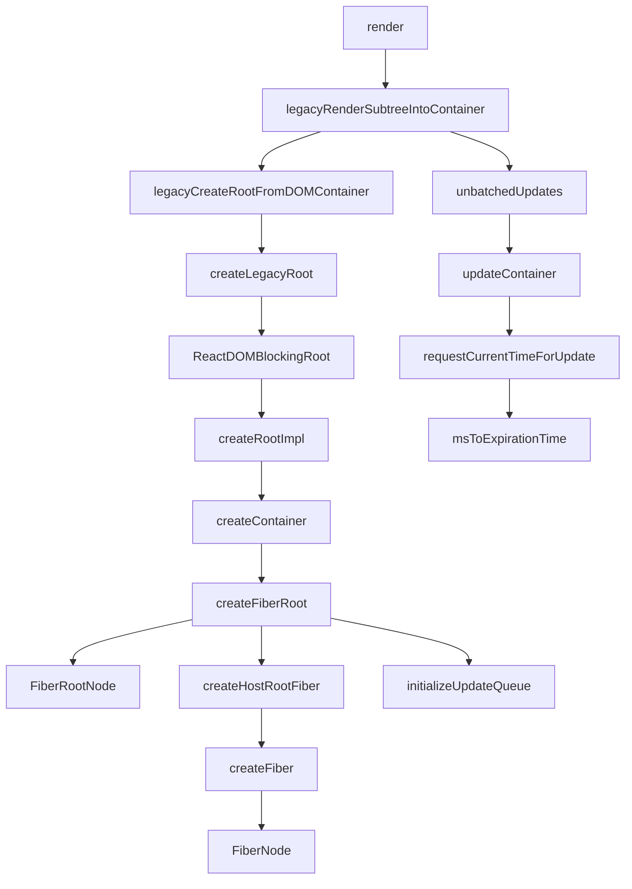
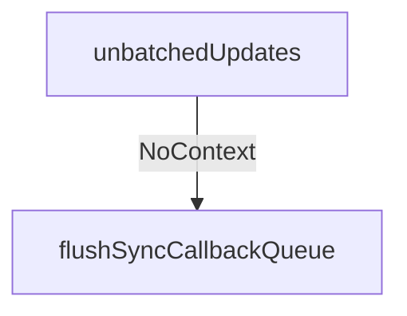

之前知道了首次渲染主要数据结构的构建过程，现在进入更新过程（下图中的右侧部分）。

<!-- more -->





|  函数名     |   参数(类型)    |   位置    |
|  ---  |  ---  |  ---  |
|  unbatchedUpdates     |   fn(Function)    |   react-reconciler/src/ReactFiberWorkLoop    |
|  updateContainer     |   element(ReactNodelist)、container(OpaqueRoot)、parentComponent(React$Component)、callback(Function)    |   react-reconciler/src/ReactFiberReconciler    |
|  requestCurrentTimeForUpdate     |      |   react-reconciler/src/ReactFiberWorkLoop    |
|  msToExpirationTime     |   ms(number)   |   react-reconciler/src/ReactFiberExpirationTime    |

---

### 函数调用

1. unbatchedUpdates
  
  这个函数内部代码描述见[参考1](https://segmentfault.com/q/1010000019803174)
  简化后的代码如下：

  ```js
    // NoContext = 0b0000000
    // BatchedContext = 0b0000001
    // LegacyUnbatchedContext = 0b0001000

    function unbatchedUpdates(fn, a) {
      const prevExecutionContext = executionContext;
      executionContext &= ~BatchedContext;
      executionContext |= LegacyUnbatchedContext;
      try {
        return fn(a);
      } finally {
        executionContext = prevExecutionContext;
        if (executionContext === NoContext) {
          // Flush the immediate callbacks that were scheduled during this batch
          flushSyncCallbackQueue();
        }
      }
    }
  ```
  进入try代码块代码的执行顺序：
  1. 执行fn(a)
  2. 执行finally中的内容
  3. 返回fn(a)的执行结果

  executionContext这个变量记录了当前在执行栈中的位置，变换规则（见[参考2](https://juejin.im/post/5dd3bebbe51d453da86c1185#heading-11)，添加、去除没问题，第二个判断是否处于某个状态感觉说的有点问题）：
  - 将当前上下文添加 render：executionContext |= RenderContext
  - 判断栈里是否有 render： executionContext & RenderContext !== noContext
  - 去除 render: executionContext &= ~RenderContext

  这里先去除BatchedContext状态，又置为LegacyUnbatchedContext盲猜是为其他地方或是fn的执行设置环境，防止出现某些问题。。。

  另外这里涉及流程控制



2.  updateContainer

此处调用：`updateContainer(children, fiberRoot, parentComponent, callback);`

简化后的代码如下：

```js
  function updateContainer(
    element,
    container,
    parentComponent,
    callback
  ) {
    const current = container.current; // FiberNode对象
    const currentTime = requestCurrentTimeForUpdate();
    const suspenseConfig = requestCurrentSuspenseConfig();
    const expirationTime = computeExpirationForFiber(
      currentTime,
      current,
      suspenseConfig,
    );

    const context = getContextForSubtree(parentComponent);
    if (container.context === null) {
      container.context = context;
    } else {
      container.pendingContext = context;
    }

    const update = createUpdate(expirationTime, suspenseConfig);
    // Caution: React DevTools currently depends on this property
    // being called "element".
    update.payload = {element};

    callback = callback === undefined ? null : callback;
    if (callback !== null) {
      update.callback = callback;
    }

    enqueueUpdate(current, update);
    scheduleUpdateOnFiber(current, expirationTime);

    return expirationTime;
  }
```
3. requestCurrentTimeForUpdate

简化后的代码如下：

```js
  function requestCurrentTimeForUpdate() {
    if ((executionContext & (RenderContext | CommitContext)) !== NoContext) {
      // We're inside React, so it's fine to read the actual time.
      return msToExpirationTime(now());
    }
    // We're not inside React, so we may be in the middle of a browser event.
    if (currentEventTime !== NoWork) {
      // Use the same start time for all updates until we enter React again.
      return currentEventTime;
    }
    // This is the first update since React yielded. Compute a new start time.
    currentEventTime = msToExpirationTime(now());
    return currentEventTime;
  }
```

首次加载前两个条件都会越过，直接到新建

4. msToExpirationTime

简化后的代码：

```js
  const UNIT_SIZE = 10;
  const MAGIC_NUMBER_OFFSET = Batched - 1;
  
  function msToExpirationTime(ms) {
    // Always subtract from the offset so that we don't clash with the magic number for NoWork.
    return MAGIC_NUMBER_OFFSET - ((ms / UNIT_SIZE) | 0);
  }
```

---

### 参考资料

1. https://segmentfault.com/q/1010000019803174
2. https://juejin.im/post/5dd3bebbe51d453da86c1185#heading-11