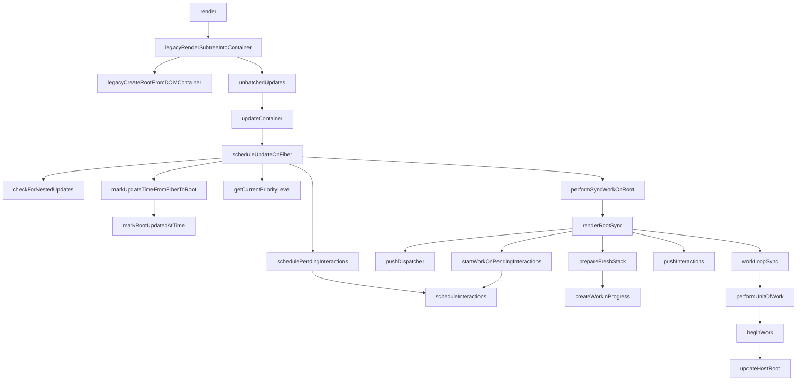

之前知道了首次渲染创建更新的过程，现在进入调度更新的过程（下图中的右侧部分，从scheduleUpdateOnFiber开始进入调度阶段）。

<!-- more -->




  <!-- beginWork  pushHostRootContext;
  pushHostRootContext  pushTopLevelContextObject;
  pushHostRootContext  pushHostContainer;
  pushHostContainer  getRootHostContext;
  getRootHostContext  getChildNamespace;
  pushHostContainer  pop;
  beginWork  bailoutOnAlreadyFinishedWork; -->


|  函数名     |   参数(类型)    |   位置    |
|  ---  |  ---  |  ---  |
|scheduleUpdateOnFiber|fiber(Fiber)、expirationTime(ExpirationTime)|react-reconciler/src/ReactFiberWorkLoop|
|checkForNestedUpdates|-|react-reconciler/src/ReactFiberWorkLoop|
|markUpdateTimeFromFiberToRoot|-|react-reconciler/src/ReactFiberWorkLoop|
|markRootUpdatedAtTime|fiber(Fiber)、expirationTime(ExpirationTime)|react-reconciler/src/ReactFiberRoot|
|getCurrentPriorityLevel|-|react-reconciler/src/SchedulerWithReactIntegration|
|schedulePendingInteractions|-|react-reconciler/src/SchedulerWithReactIntegration|
|scheduleInteractions|root, expirationTime, interactions|react-reconciler/src/ReactFiberWorkLoop|
|performSyncWorkOnRoot|root(FiberRoot)|react-reconciler/src/ReactFiberWorkLoop|
|renderRootSync|root(FiberRoot), expirationTime|react-reconciler/src/ReactFiberWorkLoop|
|pushDispatcher|root(FiberRoot), expirationTime|react-reconciler/src/ReactFiberWorkLoop|
|prepareFreshStack|root(FiberRoot), expirationTime|react-reconciler/src/ReactFiberWorkLoop|
|startWorkOnPendingInteractions|root(FiberRoot), expirationTime|react-reconciler/src/ReactFiberWorkLoop|
|startWorkOnPendingInteractions|root(FiberRoot), expirationTime, interactions|react-reconciler/src/ReactFiberWorkLoop|
|pushInteractions|root(FiberRoot)|react-reconciler/src/ReactFiberWorkLoop|
|workLoopSync|-|react-reconciler/src/ReactFiberWorkLoop|
|performUnitOfWork|workInProgress(Fiber)|react-reconciler/src/ReactFiberWorkLoop|
|createWorkInProgress|Fiber, pendingProps|react-reconciler/src/ReactFiber|
|pushHostRootContext|Fiber|react-reconciler/src/ReactFiberBeginWork|
|pushTopLevelContextObject|Fiber, context, didChange(boolean)|react-reconciler/src/ReactFiberContext|
|push|cursor(StackCursor<T>), value(T), fiber|react-reconciler/src/ReactFiberStack|
|pushHostContainer|fiber, dom|react-reconciler/src/ReactFiberHostContext|
|getRootHostContext|dom|react-dom/src/client/ReactDOMHostConfig|
|getChildNamespace|parentNamespace(string或null),type(string)|react-dom/src/shared/DOMNamespaces|
|pop|cursor(StackCursor<T>), value(T), fiber|react-reconciler/src/ReactFiberStack|
|beginWork|current(Fiber 或 null), workInProgress(Fiber), renderExpirationTime(ExpirationTime)|react-reconciler/src/ReactFiberBeginWork|
|bailoutOnAlreadyFinishedWork|current(Fiber 或 null), workInProgress(Fiber), renderExpirationTime(ExpirationTime)|react-reconciler/src/ReactFiberBeginWork|
|updateHostRoot|current(Fiber 或 null), workInProgress(Fiber), renderExpirationTime(ExpirationTime)|react-reconciler/src/ReactFiberBeginWork|

---

### 函数调用

1. scheduleUpdateOnFiber

```js
  // export const NoContext = /*             */ 0b0000000;
  // const BatchedContext = /*               */ 0b0000001;
  // const EventContext = /*                 */ 0b0000010;
  // const DiscreteEventContext = /*         */ 0b0000100;
  // const LegacyUnbatchedContext = /*       */ 0b0001000;
  // const RenderContext = /*                */ 0b0010000;
  // const CommitContext = /*                */ 0b0100000;
  export function scheduleUpdateOnFiber(
    fiber: Fiber,
    expirationTime: ExpirationTime,
  ) {
    checkForNestedUpdates();
    // warnAboutRenderPhaseUpdatesInDEV(fiber); // 这个函数运行在测试环境
    // 首次渲染这个函数给FiberRoot的pendingTime设置了范围(firstPendingTime = MAX_SIGNED_31_BIT_INT, lastPendingTime = MAX_SIGNED_31_BIT_INT)
    const root = markUpdateTimeFromFiberToRoot(fiber, expirationTime);
    if (root === null) {
      warnAboutUpdateOnUnmountedFiberInDEV(fiber);
      return;
    }

    // TODO: computeExpirationForFiber also reads the priority. Pass the
    // priority as an argument to that function and this one.
    const priorityLevel = getCurrentPriorityLevel(); // 首次渲染 NormalPriority = 3

    if (expirationTime === Sync) { // 首次渲染等于Sync
      // 首次渲染过程中，处理过executionContext的地方位于unbatchedUpdates中
      // 经过如下步骤：
      // const prevExecutionContext = executionContext;
      // executionContext &= ~BatchedContext;
      // executionContext |= LegacyUnbatchedContext;
      // 此时的executionContext中加入了LegacyUnbatchedContext，所以值为0b0001000，也就是8
      if (
        // Check if we're inside unbatchedUpdates
        (executionContext & LegacyUnbatchedContext) !== NoContext &&
        // Check if we're not already rendering
        (executionContext & (RenderContext | CommitContext)) === NoContext
      ) { // 首次渲染进入该分支
        // Register pending interactions on the root to avoid losing traced interaction data.
        schedulePendingInteractions(root, expirationTime);

        // This is a legacy edge case. The initial mount of a ReactDOM.render-ed
        // root inside of batchedUpdates should be synchronous, but layout updates
        // should be deferred until the end of the batch.
        performSyncWorkOnRoot(root);
      } else {
        ensureRootIsScheduled(root);
        schedulePendingInteractions(root, expirationTime);
        if (executionContext === NoContext) {
          // Flush the synchronous work now, unless we're already working or inside
          // a batch. This is intentionally inside scheduleUpdateOnFiber instead of
          // scheduleCallbackForFiber to preserve the ability to schedule a callback
          // without immediately flushing it. We only do this for user-initiated
          // updates, to preserve historical behavior of legacy mode.
          flushSyncCallbackQueue();
        }
      }
    } else {
      // Schedule a discrete update but only if it's not Sync.
      if (
        (executionContext & DiscreteEventContext) !== NoContext &&
        // Only updates at user-blocking priority or greater are considered
        // discrete, even inside a discrete event.
        (priorityLevel === UserBlockingPriority ||
          priorityLevel === ImmediatePriority)
      ) {
        // This is the result of a discrete event. Track the lowest priority
        // discrete update per root so we can flush them early, if needed.
        if (rootsWithPendingDiscreteUpdates === null) {
          rootsWithPendingDiscreteUpdates = new Map([[root, expirationTime]]);
        } else {
          const lastDiscreteTime = rootsWithPendingDiscreteUpdates.get(root);
          if (
            lastDiscreteTime === undefined ||
            lastDiscreteTime > expirationTime
          ) {
            rootsWithPendingDiscreteUpdates.set(root, expirationTime);
          }
        }
      }
      // Schedule other updates after in case the callback is sync.
      ensureRootIsScheduled(root);
      schedulePendingInteractions(root, expirationTime);
    }
  }
```

2. checkForNestedUpdates

```js
  const NESTED_UPDATE_LIMIT = 50;
  let nestedUpdateCount: number = 0;

  function checkForNestedUpdates() {
    if (nestedUpdateCount > NESTED_UPDATE_LIMIT) {
      nestedUpdateCount = 0;
      rootWithNestedUpdates = null;
      invariant(
        false,
        'Maximum update depth exceeded. This can happen when a component ' +
          'repeatedly calls setState inside componentWillUpdate or ' +
          'componentDidUpdate. React limits the number of nested updates to ' +
          'prevent infinite loops.',
      );
    }
  }
```
3. markUpdateTimeFromFiberToRoot

传入该函数的fiber值：

```js
// ====================fiber============================
  {
    actualDuration: 0,
    actualStartTime: -1,
    alternate: null,
    child: null,
    childExpirationTime: NoWork, // 0
    dependencies_old: null,
    effectTag: NoEffect, // 0
    elementType: null,
    expirationTime: NoWork, // 0
    firstEffect: null,
    index: 0,
    key: null,
    lastEffect: null,
    memoizedProps: null,
    memoizedState: null,
    mode: NoMode, // 0
    nextEffect: null,
    pendingProps: null,
    ref: null,
    return: null,
    setBaseDuration: 0,
    sibling: null,
    stateNode: container,
    tag: HostRoot, // 3
    treeBaseDuration: 0,
    type: null,
    updateQueue: {
      baseState: null,
      effects: null,
      firstBaseUpdate: null,
      lastBaseUpdate: null,
      shared: {
        pending: null,
      },
    },
  }

  // ======================expirationTime==================

  MAX_SIGNED_31_BIT_INT, // 1073741823

  // ======================FiberRoot=======================

  {
    callbackNode: null,
    callbackPriority_old: Nopriority, // 90
    containerInfo: '<div id="root">', // dom元素()
    context: {},
    current,
    finishedExpirationTime: NoWork, // 0
    finishedWork: null,
    firstPendingTime: NoWork, // 0
    firstSuspendedTime: NoWork, // 0
    hydrate: false,
    interactionThreadID: 1,
    lastExpiredTime: NoWork, // 0
    lastPendingTime: NoWork, // 0
    lastPingedTime: NoWork, // 0
    lastSuspendedTime: NoWork, // 0
    memoizedInteractions: Set[],
    mutableSourceEagerHydrationData: null,
    mutableSourceLastPendingUpdateTime: NoWork, // 0
    nextKnownPendingLevel: NoWork, // 0
    pendingChildren: null,
    pendingContext: null,
    pendingInteractionMap_old: Map(0),
    pingCache: null,
    timeoutHandle: noTimeout, // -1
    tag: LegacyRoot, // 0
  }
```

```js
  let workInProgressRoot: FiberRoot | null = null;


  // This is split into a separate function so we can mark a fiber with pending
  // work without treating it as a typical update that originates from an event;
  // e.g. retrying a Suspense boundary isn't an update, but it does schedule work
  // on a fiber.
  function markUpdateTimeFromFiberToRoot(fiber, expirationTime) {
    // Update the source fiber's expiration time
    if (fiber.expirationTime < expirationTime) {
      fiber.expirationTime = expirationTime;
    }
    let alternate = fiber.alternate;
    if (alternate !== null && alternate.expirationTime < expirationTime) { // 首次渲染alternate是null，不会进入这个分支
      alternate.expirationTime = expirationTime;
    }

    // Walk the parent path to the root and update the child expiration time.
    let node = fiber.return; // 首次渲染，值为null
    let root = null;
    if (node === null && fiber.tag === HostRoot) { // 首次渲染进入该分支
      root = fiber.stateNode; // 首次渲染值为FiberRoot
    } else {
      while (node !== null) {
        alternate = node.alternate;
        if (node.childExpirationTime < expirationTime) {
          node.childExpirationTime = expirationTime;
          if (
            alternate !== null &&
            alternate.childExpirationTime < expirationTime
          ) {
            alternate.childExpirationTime = expirationTime;
          }
        } else if (
          alternate !== null &&
          alternate.childExpirationTime < expirationTime
        ) {
          alternate.childExpirationTime = expirationTime;
        }
        if (node.return === null && node.tag === HostRoot) {
          root = node.stateNode;
          break;
        }
        node = node.return;
      }
    }

    if (root !== null) {
      if (workInProgressRoot === root) { // 首次渲染 workInProgressRoot === null，不进入该分支
        // Received an update to a tree that's in the middle of rendering. Mark
        // that's unprocessed work on this root.
        markUnprocessedUpdateTime(expirationTime);

        if (workInProgressRootExitStatus === RootSuspendedWithDelay) {
          // The root already suspended with a delay, which means this render
          // definitely won't finish. Since we have a new update, let's mark it as
          // suspended now, right before marking the incoming update. This has the
          // effect of interrupting the current render and switching to the update.
          // TODO: This happens to work when receiving an update during the render
          // phase, because of the trick inside computeExpirationForFiber to
          // subtract 1 from `renderExpirationTime` to move it into a
          // separate bucket. But we should probably model it with an exception,
          // using the same mechanism we use to force hydration of a subtree.
          // TODO: This does not account for low pri updates that were already
          // scheduled before the root started rendering. Need to track the next
          // pending expiration time (perhaps by backtracking the return path) and
          // then trigger a restart in the `renderDidSuspendDelayIfPossible` path.
          markRootSuspendedAtTime(root, renderExpirationTime);
        }
      }
      // Mark that the root has a pending update.
      markRootUpdatedAtTime(root, expirationTime);
    }

    return root;
  }
```
4. markRootUpdatedAtTime

首次渲染的时候上面的函数没有执行实质性的操作，该函数做的实质性操作是给FiberRoot的pending times设置了范围

```js
// Mark that the root has a pending update.

export function markRootUpdatedAtTime(
  root: FiberRoot,
  expirationTime: ExpirationTime,
): void {
  // Update the range of pending times
  const firstPendingTime = root.firstPendingTime; // 首次渲染 NoWork = 0
  if (expirationTime > firstPendingTime) {
    root.firstPendingTime = expirationTime; // 首次渲染 MAX_SIGNED_31_BIT_INT = 1073741823
  }
  const lastPendingTime = root.lastPendingTime; // 首次渲染 NoWork = 0
  if (lastPendingTime === NoWork || expirationTime < lastPendingTime) {
    root.lastPendingTime = expirationTime; // 首次渲染 MAX_SIGNED_31_BIT_INT = 1073741823
  }

  // Update the range of suspended times. Treat everything lower priority or
  // equal to this update as unsuspended.
  const firstSuspendedTime = root.firstSuspendedTime; // 首次渲染 NoWork = 0
  if (firstSuspendedTime !== NoWork) { // 首次渲染不会进入该分支
    if (expirationTime >= firstSuspendedTime) {
      // The entire suspended range is now unsuspended.
      root.firstSuspendedTime = root.lastSuspendedTime = root.nextKnownPendingLevel = NoWork;
    } else if (expirationTime >= root.lastSuspendedTime) {
      root.lastSuspendedTime = expirationTime + 1;
    }

    // This is a pending level. Check if it's higher priority than the next
    // known pending level.
    if (expirationTime > root.nextKnownPendingLevel) {
      root.nextKnownPendingLevel = expirationTime;
    }
  }
}
```
5. getCurrentPriorityLevel

```js
  export const NoPriority = 0;
  export const ImmediatePriority = 1;
  export const UserBlockingPriority = 2;
  export const NormalPriority = 3;
  export const LowPriority = 4;
  export const IdlePriority = 5;

  var currentPriorityLevel = NormalPriority;
  // Scheduler_getCurrentPriorityLevel就是unstable_getCurrentPriorityLevel
  function unstable_getCurrentPriorityLevel() {
    return currentPriorityLevel;
  }

  // ImmediatePriority as unstable_ImmediatePriority,
  // UserBlockingPriority as unstable_UserBlockingPriority,
  // NormalPriority as unstable_NormalPriority,
  // IdlePriority as unstable_IdlePriority,
  // LowPriority as unstable_LowPriority,

  // unstable_ImmediatePriority: Scheduler_ImmediatePriority,
  // unstable_UserBlockingPriority: Scheduler_UserBlockingPriority,
  // unstable_NormalPriority: Scheduler_NormalPriority,
  // unstable_LowPriority: Scheduler_LowPriority,
  // unstable_IdlePriority: Scheduler_IdlePriority,

  function getCurrentPriorityLevel(): ReactPriorityLevel {
    switch (Scheduler_getCurrentPriorityLevel()) {
      case Scheduler_ImmediatePriority:
        return ImmediatePriority;
      case Scheduler_UserBlockingPriority:
        return UserBlockingPriority;
      case Scheduler_NormalPriority:
        return NormalPriority;
      case Scheduler_LowPriority:
        return LowPriority;
      case Scheduler_IdlePriority:
        return IdlePriority;
      default:
        invariant(false, 'Unknown priority level.');
    }
  }
```
首次渲染返回的结果是NormalPriority

6. schedulePendingInteractions

```js
  function schedulePendingInteractions(root, expirationTime) {
    // This is called when work is scheduled on a root.
    // It associates the current interactions with the newly-scheduled expiration.
    // They will be restored when that expiration is later committed.
    if (!enableSchedulerTracing) { // enableSchedulerTracing = true
      return;
    }
    scheduleInteractions(root, expirationTime, __interactionsRef.current); // __interactionsRef.current = Set[]
  }
```

代码中的`__interactionsRef`初始值是null，但何时更改了新值完全没发现。。。最一开始调用`createElement`的时候就已经是此处看到的值了。。。

7. scheduleInteractions

首次渲染，不进入任何分支

```js
  function scheduleInteractions(root, expirationTime, interactions) {
    if (!enableSchedulerTracing) {
      return;
    }

    if (interactions.size > 0) {
      const pendingInteractionMap = root.pendingInteractionMap_old;
      const pendingInteractions = pendingInteractionMap.get(expirationTime);
      if (pendingInteractions != null) {
        interactions.forEach(interaction => {
          if (!pendingInteractions.has(interaction)) {
            // Update the pending async work count for previously unscheduled interaction.
            interaction.__count++;
          }

          pendingInteractions.add(interaction);
        });
      } else {
        pendingInteractionMap.set(expirationTime, new Set(interactions));

        // Update the pending async work count for the current interactions.
        interactions.forEach(interaction => {
          interaction.__count++;
        });
      }

      const subscriber = __subscriberRef.current;
      if (subscriber !== null) {
        const threadID = computeThreadID(root, expirationTime);
        subscriber.onWorkScheduled(interactions, threadID);
      }
    }
  }
```

8. performSyncWorkOnRoot

首次渲染走同步流程

```js
  // This is the entry point for synchronous tasks that don't go
  // through Scheduler
  function performSynliuchengcWorkOnRoot(root) {
    invariant(
      (executionContext & (RenderContext | CommitContext)) === NoContext,
      'Should not already be working.',
    );

    flushPassiveEffects(); // 首次渲染内部不会进入分支，直接跳出

    const lastExpiredTime = root.lastExpiredTime; // 首次渲染NoWork

    let expirationTime;
    if (lastExpiredTime !== NoWork) {
      // There's expired work on this root. Check if we have a partial tree
      // that we can reuse.
      if (
        root === workInProgressRoot &&
        renderExpirationTime >= lastExpiredTime
      ) {
        // There's a partial tree with equal or greater than priority than the
        // expired level. Finish rendering it before rendering the rest of the
        // expired work.
        expirationTime = renderExpirationTime;
      } else {
        // Start a fresh tree.
        expirationTime = lastExpiredTime;
      }
    } else {
      // There's no expired work. This must be a new, synchronous render.
      expirationTime = Sync; // 首次渲染 MAX_SIGNED_31_BIT_INT 1073741823
    }

    let exitStatus = renderRootSync(root, expirationTime);

    if (root.tag !== LegacyRoot && exitStatus === RootErrored) {
      executionContext |= RetryAfterError;

      // If an error occurred during hydration,
      // discard server response and fall back to client side render.
      if (root.hydrate) {
        root.hydrate = false;
        clearContainer(root.containerInfo);
      }

      // If something threw an error, try rendering one more time. We'll
      // render synchronously to block concurrent data mutations, and we'll
      // render at Idle (or lower) so that all pending updates are included.
      // If it still fails after the second attempt, we'll give up and commit
      // the resulting tree.
      expirationTime = expirationTime > Idle ? Idle : expirationTime;
      exitStatus = renderRootSync(root, expirationTime);
    }

    if (exitStatus === RootFatalErrored) {
      const fatalError = workInProgressRootFatalError;
      prepareFreshStack(root, expirationTime);
      markRootSuspendedAtTime(root, expirationTime);
      ensureRootIsScheduled(root);
      throw fatalError;
    }

    // We now have a consistent tree. Because this is a sync render, we
    // will commit it even if something suspended.
    const finishedWork: Fiber = (root.current.alternate: any);
    root.finishedWork = finishedWork;
    root.finishedExpirationTime = expirationTime;
    root.nextKnownPendingLevel = getRemainingExpirationTime(finishedWork);
    commitRoot(root);

    // Before exiting, make sure there's a callback scheduled for the next
    // pending level.
    ensureRootIsScheduled(root);

    return null;
  }
```

9. renderRootSync

```js
  // 首次渲染过程中，处理过executionContext的地方位于unbatchedUpdates中
  // 经过如下步骤：
  // const prevExecutionContext = executionContext;
  // executionContext &= ~BatchedContext;
  // executionContext |= LegacyUnbatchedContext;
  // 此时的executionContext中加入了LegacyUnbatchedContext，所以值为0b0001000，也就是8

  // const RenderContext = 0b0010000;
  // let renderExpirationTime: ExpirationTime = NoWork;

  function renderRootSync(root, expirationTime) {
    const prevExecutionContext = executionContext; // LegacyUnbatchedContext = 0b0001000
    executionContext |= RenderContext; // RenderContext | LegacyUnbatchedContext = 0b0011000
    const prevDispatcher = pushDispatcher(root); // 首次渲染此处的返回值见下方
    
    // 每太明白下面的注释
    // If the root or expiration time have changed, throw out the existing stack
    // and prepare a fresh one. Otherwise we'll continue where we left off.
    if (root !== workInProgressRoot || expirationTime !== renderExpirationTime) { // 首次渲染会进入该分支
      prepareFreshStack(root, expirationTime);
      startWorkOnPendingInteractions(root, expirationTime);
    }

    const prevInteractions = pushInteractions(root);

    do {
      try {
        workLoopSync();
        break;
      } catch (thrownValue) {
        handleError(root, thrownValue);
      }
    } while (true);
    resetContextDependencies();
    if (enableSchedulerTracing) {
      popInteractions(((prevInteractions: any): Set<Interaction>));
    }

    executionContext = prevExecutionContext;
    popDispatcher(prevDispatcher);

    if (workInProgress !== null) {
      // This is a sync render, so we should have finished the whole tree.
      invariant(
        false,
        'Cannot commit an incomplete root. This error is likely caused by a ' +
          'bug in React. Please file an issue.',
      );
    }

    // Set this to null to indicate there's no in-progress render.
    workInProgressRoot = null;

    return workInProgressRootExitStatus;
  }
```

10. pushDispatcher

```js
  /**
  * Keeps track of the current dispatcher.
  */
  const ReactCurrentDispatcher = {
    current: (null: null | Dispatcher),
  };

  const ContextOnlyDispatcher = {
    readContext,
    useCallback: throwInvalidHookError,
    useContext: throwInvalidHookError,
    useEffect: throwInvalidHookError,
    useImperativeHandle: throwInvalidHookError,
    useLayoutEffect: throwInvalidHookError,
    useMemo: throwInvalidHookError,
    useReducer: throwInvalidHookError,
    useRef: throwInvalidHookError,
    useState: throwInvalidHookError,
    useDebugValue: throwInvalidHookError,
    useResponder: throwInvalidHookError,
    useDeferredValue: throwInvalidHookError,
    useTransition: throwInvalidHookError,
    useMutableSource: throwInvalidHookError,
    useOpaqueIdentifier: throwInvalidHookError,

    unstable_isNewReconciler: enableNewReconciler,
  };

  function pushDispatcher(root) {
    const prevDispatcher = ReactCurrentDispatcher.current;
    ReactCurrentDispatcher.current = ContextOnlyDispatcher;
    if (prevDispatcher === null) {
      // The React isomorphic package does not include a default dispatcher.
      // Instead the first renderer will lazily attach one, in order to give
      // nicer error messages.
      return ContextOnlyDispatcher; // 这里返回ContextOnlyDispatcher（感觉像是和Hook相关的）
    } else {
      return prevDispatcher;
    }
  }
```

11. prepareFreshStack

```js
  // export const noTimeout = -1;

  // // The root we're working on
  // let workInProgressRoot: FiberRoot | null = null;

  // // The fiber we're working on
  // let workInProgress: Fiber | null = null;

  // const RootIncomplete = 0;
  // // Whether to root completed, errored, suspended, etc.
  // let workInProgressRootExitStatus: RootExitStatus = RootIncomplete;

  // // A fatal error, if one is thrown
  // let workInProgressRootFatalError: mixed = null;

  // // Most recent event time among processed updates during this render.
  // // This is conceptually a time stamp but expressed in terms of an ExpirationTime
  // // because we deal mostly with expiration times in the hot path, so this avoids
  // // the conversion happening in the hot path.
  // let workInProgressRootLatestProcessedExpirationTime: ExpirationTime = Sync;
  // let workInProgressRootLatestSuspenseTimeout: ExpirationTime = Sync;
  // let workInProgressRootCanSuspendUsingConfig: null | SuspenseConfig = null;

  // // The work left over by components that were visited during this render. Only
  // // includes unprocessed updates, not work in bailed out children.
  // let workInProgressRootNextUnprocessedUpdateTime: ExpirationTime = NoWork;

  // // If we're pinged while rendering we don't always restart immediately.
  // // This flag determines if it might be worthwhile to restart if an opportunity
  // // happens latere.
  // let workInProgressRootHasPendingPing: boolean = false;

  // // Marks the need to reschedule pending interactions at these expiration times
  // // during the commit phase. This enables them to be traced across components
  // // that spawn new work during render. E.g. hidden boundaries, suspended SSR
  // // hydration or SuspenseList.
  // let spawnedWorkDuringRender: null | Array<ExpirationTime> = null;

  function prepareFreshStack(root, expirationTime) {
    root.finishedWork = null;
    root.finishedExpirationTime = NoWork;

    const timeoutHandle = root.timeoutHandle; // 首次渲染时 -1
    if (timeoutHandle !== noTimeout) { // 首次渲染不进入该分支
      // The root previous suspended and scheduled a timeout to commit a fallback
      // state. Now that we have additional work, cancel the timeout.
      root.timeoutHandle = noTimeout;
      // $FlowFixMe Complains noTimeout is not a TimeoutID, despite the check above
      cancelTimeout(timeoutHandle);
    }

    // Check if there's a suspended level at lower priority.
    const lastSuspendedTime = root.lastSuspendedTime; // 0
    if (lastSuspendedTime !== NoWork && lastSuspendedTime < expirationTime) { // 首次渲染不进入该分支
      const lastPingedTime = root.lastPingedTime;
      // Make sure the suspended level is marked as pinged so that we return back
      // to it later, in case the render we're about to start gets aborted.
      // Generally we only reach this path via a ping, but we shouldn't assume
      // that will always be the case.
      // Note: This is defensive coding to prevent a pending commit from
      // being dropped without being rescheduled. It shouldn't be necessary.
      if (lastPingedTime === NoWork || lastPingedTime > lastSuspendedTime) {
        root.lastPingedTime = lastSuspendedTime;
      }
    }

    if (workInProgress !== null) { // 首次渲染不进入该分支
      let interruptedWork = workInProgress.return;
      while (interruptedWork !== null) {
        unwindInterruptedWork(interruptedWork);
        interruptedWork = interruptedWork.return;
      }
    }
    workInProgressRoot = root;
    workInProgress = createWorkInProgress(root.current, null);
    renderExpirationTime = expirationTime;
    workInProgressRootExitStatus = RootIncomplete;
    workInProgressRootFatalError = null;
    workInProgressRootLatestProcessedExpirationTime = Sync;
    workInProgressRootLatestSuspenseTimeout = Sync;
    workInProgressRootCanSuspendUsingConfig = null;
    workInProgressRootNextUnprocessedUpdateTime = NoWork;
    workInProgressRootHasPendingPing = false;

    if (enableSchedulerTracing) {
      spawnedWorkDuringRender = null;
    }
  }
```

12.  createWorkInProgress

首次渲染时的调用：`createWorkInProgress(root.current, null);`

```js
  // 此时的current
  {
    actualDuration: 0,
    actualStartTime: -1,
    alternate: null,
    child: null,
    childExpirationTime: NoWork, // 0
    dependencies_old: null,
    effectTag: NoEffect, // 0
    elementType: null,
    expirationTime: NoWork, // 0
    firstEffect: null,
    index: 0,
    key: null,
    lastEffect: null,
    memoizedProps: null,
    memoizedState: null,
    mode: NoMode, // 0
    nextEffect: null,
    pendingProps: null,
    ref: null,
    return: null,
    setBaseDuration: 0,
    sibling: null,
    stateNode: container,
    tag: HostRoot, // 3
    treeBaseDuration: 0,
    type: null,
    updateQueue: {
      baseState: null,
      effects: null,
      firstBaseUpdate: null,
      lastBaseUpdate: null,
      shared: {
        pending: null,
      },
    },
  }
  // This is used to create an alternate fiber to do work on.
  export function createWorkInProgress(current: Fiber, pendingProps: any): Fiber {
    let workInProgress = current.alternate; // 首次渲染 null
    if (workInProgress === null) {
      // We use a double buffering pooling technique because we know that we'll
      // only ever need at most two versions of a tree. We pool the "other" unused
      // node that we're free to reuse. This is lazily created to avoid allocating
      // extra objects for things that are never updated. It also allow us to
      // reclaim the extra memory if needed.
      workInProgress = createFiber(
        current.tag,
        pendingProps,
        current.key,
        current.mode,
      );
      workInProgress.elementType = current.elementType;
      workInProgress.type = current.type;
      workInProgress.stateNode = current.stateNode;
      // 上面的操作相当于半深拷贝了一个root对应的Fiber为workInProgress
      // 然后通过Fiber的alternate属性将current和workInProgress两个Fiber相互引用
      workInProgress.alternate = current; 
      current.alternate = workInProgress;
    } else {
      workInProgress.pendingProps = pendingProps;
      // Needed because Blocks store data on type.
      workInProgress.type = current.type;

      // We already have an alternate.
      // Reset the effect tag.
      workInProgress.effectTag = NoEffect;

      // The effect list is no longer valid.
      workInProgress.nextEffect = null;
      workInProgress.firstEffect = null;
      workInProgress.lastEffect = null;

      if (enableProfilerTimer) {
        // We intentionally reset, rather than copy, actualDuration & actualStartTime.
        // This prevents time from endlessly accumulating in new commits.
        // This has the downside of resetting values for different priority renders,
        // But works for yielding (the common case) and should support resuming.
        workInProgress.actualDuration = 0;
        workInProgress.actualStartTime = -1;
      }
    }

    workInProgress.childExpirationTime = current.childExpirationTime;
    workInProgress.expirationTime = current.expirationTime;

    workInProgress.child = current.child;
    workInProgress.memoizedProps = current.memoizedProps;
    workInProgress.memoizedState = current.memoizedState;
    workInProgress.updateQueue = current.updateQueue;

    // Clone the dependencies object. This is mutated during the render phase, so
    // it cannot be shared with the current fiber.
    const currentDependencies = current.dependencies_old;
    workInProgress.dependencies_old =
      currentDependencies === null
        ? null
        : {
            expirationTime: currentDependencies.expirationTime,
            firstContext: currentDependencies.firstContext,
            responders: currentDependencies.responders,
          };

    // These will be overridden during the parent's reconciliation
    workInProgress.sibling = current.sibling;
    workInProgress.index = current.index;
    workInProgress.ref = current.ref;

    if (enableProfilerTimer) {
      workInProgress.selfBaseDuration = current.selfBaseDuration;
      workInProgress.treeBaseDuration = current.treeBaseDuration;
    }

    return workInProgress;
  }
```

13. schedulePendingInteractions

```js
  function schedulePendingInteractions(root, expirationTime) {
    // This is called when work is scheduled on a root.
    // It associates the current interactions with the newly-scheduled expiration.
    // They will be restored when that expiration is later committed.
    if (!enableSchedulerTracing) {
      return;
    }
    scheduleInteractions(root, expirationTime, __interactionsRef.current);
  }

```

14. scheduleInteractions

```js
  function scheduleInteractions(root, expirationTime, interactions) {
    if (!enableSchedulerTracing) {
      return;
    }
    if (interactions.size > 0) { // 首次渲染不会进入该分支
      const pendingInteractionMap = root.pendingInteractionMap_old;
      const pendingInteractions = pendingInteractionMap.get(expirationTime);
      if (pendingInteractions != null) {
        interactions.forEach(interaction => {
          if (!pendingInteractions.has(interaction)) {
            // Update the pending async work count for previously unscheduled interaction.
            interaction.__count++;
          }

          pendingInteractions.add(interaction);
        });
      } else {
        pendingInteractionMap.set(expirationTime, new Set(interactions));

        // Update the pending async work count for the current interactions.
        interactions.forEach(interaction => {
          interaction.__count++;
        });
      }

      const subscriber = __subscriberRef.current;
      if (subscriber !== null) {
        const threadID = computeThreadID(root, expirationTime);
        subscriber.onWorkScheduled(interactions, threadID);
      }
    }
  }
```

15. pushInteractions

```js
  function pushInteractions(root) {
    if (enableSchedulerTracing) {
      const prevInteractions: Set<Interaction> | null = __interactionsRef.current;
      __interactionsRef.current = root.memoizedInteractions;
      return prevInteractions;
    }
    return null;
  }
```


16. workLoopSync

```js
// The work loop is an extremely hot path. Tell Closure not to inline it.

function workLoopSync() {
  // Already timed out, so perform work without checking if we need to yield.
  while (workInProgress !== null) {
    performUnitOfWork(workInProgress);
  }
}
```

17. performUnitOfWork

```js
  // renderExpirationTime的值在执行prepareFreshStack函数时被赋予了新值

  function performUnitOfWork(unitOfWork: Fiber): void {
    // The current, flushed, state of this fiber is the alternate. Ideally
    // nothing should rely on this, but relying on it here means that we don't
    // need an additional field on the work in progress.
    const current = unitOfWork.alternate;

    let next;
    if (enableProfilerTimer && (unitOfWork.mode & ProfileMode) !== NoMode) {
      startProfilerTimer(unitOfWork);
      next = beginWork(current, unitOfWork, renderExpirationTime);
      stopProfilerTimerIfRunningAndRecordDelta(unitOfWork, true);
    } else { // 首次渲染进入该分支
      next = beginWork(current, unitOfWork, renderExpirationTime);
    }

    unitOfWork.memoizedProps = unitOfWork.pendingProps;
    if (next === null) {
      // If this doesn't spawn new work, complete the current work.
      completeUnitOfWork(unitOfWork);
    } else {
      workInProgress = next;
    }

    ReactCurrentOwner.current = null;
  }
```

18. beginWork

这个函数也太长了吧。。。

```js
  function beginWork(
    current: Fiber | null,
    workInProgress: Fiber,
    renderExpirationTime: ExpirationTime,
  ): Fiber | null {
    // 首次expirationTime为0
    const updateExpirationTime = workInProgress.expirationTime;

    if (current !== null) {
      const oldProps = current.memoizedProps;
      const newProps = workInProgress.pendingProps;

      if (
        oldProps !== newProps ||
        hasLegacyContextChanged() ||
        // Force a re-render if the implementation changed due to hot reload:
        (__DEV__ ? workInProgress.type !== current.type : false)
      ) {
        // If props or context changed, mark the fiber as having performed work.
        // This may be unset if the props are determined to be equal later (memo).
        didReceiveUpdate = true;
      } else if (updateExpirationTime < renderExpirationTime) { // updateExpirationTime = renderExpirationTime = 1073741823
        didReceiveUpdate = false;
        // This fiber does not have any pending work. Bailout without entering
        // the begin phase. There's still some bookkeeping we that needs to be done
        // in this optimized path, mostly pushing stuff onto the stack.
        switch (workInProgress.tag) {
          case HostRoot:
            pushHostRootContext(workInProgress);
            resetHydrationState();
            break;
          case HostComponent:
            pushHostContext(workInProgress);
            if (
              workInProgress.mode & ConcurrentMode &&
              renderExpirationTime !== Never &&
              shouldDeprioritizeSubtree(workInProgress.type, newProps)
            ) {
              if (enableSchedulerTracing) {
                markSpawnedWork(Never);
              }
              // Schedule this fiber to re-render at offscreen priority. Then bailout.
              workInProgress.expirationTime = workInProgress.childExpirationTime = Never;
              return null;
            }
            break;
          case ClassComponent: {
            const Component = workInProgress.type;
            if (isLegacyContextProvider(Component)) {
              pushLegacyContextProvider(workInProgress);
            }
            break;
          }
          case HostPortal:
            pushHostContainer(
              workInProgress,
              workInProgress.stateNode.containerInfo,
            );
            break;
          case ContextProvider: {
            const newValue = workInProgress.memoizedProps.value;
            pushProvider(workInProgress, newValue);
            break;
          }
          case Profiler:
            if (enableProfilerTimer) {
              // Profiler should only call onRender when one of its descendants actually rendered.
              const hasChildWork =
                workInProgress.childExpirationTime >= renderExpirationTime;
              if (hasChildWork) {
                workInProgress.effectTag |= Update;
              }

              // Reset effect durations for the next eventual effect phase.
              // These are reset during render to allow the DevTools commit hook a chance to read them,
              const stateNode = workInProgress.stateNode;
              stateNode.effectDuration = 0;
              stateNode.passiveEffectDuration = 0;
            }
            break;
          case SuspenseComponent: {
            const state: SuspenseState | null = workInProgress.memoizedState;
            if (state !== null) {
              if (enableSuspenseServerRenderer) {
                if (state.dehydrated !== null) {
                  pushSuspenseContext(
                    workInProgress,
                    setDefaultShallowSuspenseContext(suspenseStackCursor.current),
                  );
                  // We know that this component will suspend again because if it has
                  // been unsuspended it has committed as a resolved Suspense component.
                  // If it needs to be retried, it should have work scheduled on it.
                  workInProgress.effectTag |= DidCapture;

                  return null;
                }
              }

              // If this boundary is currently timed out, we need to decide
              // whether to retry the primary children, or to skip over it and
              // go straight to the fallback. Check the priority of the primary
              // child fragment.
              const primaryChildFragment: Fiber = (workInProgress.child: any);
              const primaryChildExpirationTime =
                primaryChildFragment.childExpirationTime;
              if (primaryChildExpirationTime >= renderExpirationTime) {
                // The primary children have pending work. Use the normal path
                // to attempt to render the primary children again.
                return updateSuspenseComponent(
                  current,
                  workInProgress,
                  renderExpirationTime,
                );
              } else {
                // The primary child fragment does not have pending work marked
                // on it...

                // ...usually. There's an unfortunate edge case where the fragment
                // fiber is not part of the return path of the children, so when
                // an update happens, the fragment doesn't get marked during
                // setState. This is something we should consider addressing when
                // we refactor the Fiber data structure. (There's a test with more
                // details; to find it, comment out the following block and see
                // which one fails.)
                //
                // As a workaround, we need to recompute the `childExpirationTime`
                // by bubbling it up from the next level of children. This is
                // based on similar logic in `resetChildExpirationTime`.
                let primaryChild = primaryChildFragment.child;
                while (primaryChild !== null) {
                  const childUpdateExpirationTime = primaryChild.expirationTime;
                  const childChildExpirationTime =
                    primaryChild.childExpirationTime;
                  if (
                    childUpdateExpirationTime >= renderExpirationTime ||
                    childChildExpirationTime >= renderExpirationTime
                  ) {
                    // Found a child with an update with sufficient priority.
                    // Use the normal path to render the primary children again.
                    return updateSuspenseComponent(
                      current,
                      workInProgress,
                      renderExpirationTime,
                    );
                  }
                  primaryChild = primaryChild.sibling;
                }

                pushSuspenseContext(
                  workInProgress,
                  setDefaultShallowSuspenseContext(suspenseStackCursor.current),
                );
                // The primary children do not have pending work with sufficient
                // priority. Bailout.
                const child = bailoutOnAlreadyFinishedWork(
                  current,
                  workInProgress,
                  renderExpirationTime,
                );
                if (child !== null) {
                  // The fallback children have pending work. Skip over the
                  // primary children and work on the fallback.
                  return child.sibling;
                } else {
                  return null;
                }
              }
            } else {
              pushSuspenseContext(
                workInProgress,
                setDefaultShallowSuspenseContext(suspenseStackCursor.current),
              );
            }
            break;
          }
          case SuspenseListComponent: {
            const didSuspendBefore =
              (current.effectTag & DidCapture) !== NoEffect;

            const hasChildWork =
              workInProgress.childExpirationTime >= renderExpirationTime;

            if (didSuspendBefore) {
              if (hasChildWork) {
                // If something was in fallback state last time, and we have all the
                // same children then we're still in progressive loading state.
                // Something might get unblocked by state updates or retries in the
                // tree which will affect the tail. So we need to use the normal
                // path to compute the correct tail.
                return updateSuspenseListComponent(
                  current,
                  workInProgress,
                  renderExpirationTime,
                );
              }
              // If none of the children had any work, that means that none of
              // them got retried so they'll still be blocked in the same way
              // as before. We can fast bail out.
              workInProgress.effectTag |= DidCapture;
            }

            // If nothing suspended before and we're rendering the same children,
            // then the tail doesn't matter. Anything new that suspends will work
            // in the "together" mode, so we can continue from the state we had.
            const renderState = workInProgress.memoizedState;
            if (renderState !== null) {
              // Reset to the "together" mode in case we've started a different
              // update in the past but didn't complete it.
              renderState.rendering = null;
              renderState.tail = null;
              renderState.lastEffect = null;
            }
            pushSuspenseContext(workInProgress, suspenseStackCursor.current);

            if (hasChildWork) {
              break;
            } else {
              // If none of the children had any work, that means that none of
              // them got retried so they'll still be blocked in the same way
              // as before. We can fast bail out.
              return null;
            }
          }
        }
        return bailoutOnAlreadyFinishedWork(
          current,
          workInProgress,
          renderExpirationTime,
        );
      } else {
        // An update was scheduled on this fiber, but there are no new props
        // nor legacy context. Set this to false. If an update queue or context
        // consumer produces a changed value, it will set this to true. Otherwise,
        // the component will assume the children have not changed and bail out.
        didReceiveUpdate = false;
      }
    } else {
      didReceiveUpdate = false; // 首次渲染直接到这里
    }

    // Before entering the begin phase, clear pending update priority.
    // TODO: This assumes that we're about to evaluate the component and process
    // the update queue. However, there's an exception: SimpleMemoComponent
    // sometimes bails out later in the begin phase. This indicates that we should
    // move this assignment out of the common path and into each branch.
    workInProgress.expirationTime = NoWork;

    switch (workInProgress.tag) {
      case IndeterminateComponent: {
        return mountIndeterminateComponent(
          current,
          workInProgress,
          workInProgress.type,
          renderExpirationTime,
        );
      }
      case LazyComponent: {
        const elementType = workInProgress.elementType;
        return mountLazyComponent(
          current,
          workInProgress,
          elementType,
          updateExpirationTime,
          renderExpirationTime,
        );
      }
      case FunctionComponent: {
        const Component = workInProgress.type;
        const unresolvedProps = workInProgress.pendingProps;
        const resolvedProps =
          workInProgress.elementType === Component
            ? unresolvedProps
            : resolveDefaultProps(Component, unresolvedProps);
        return updateFunctionComponent(
          current,
          workInProgress,
          Component,
          resolvedProps,
          renderExpirationTime,
        );
      }
      case ClassComponent: {
        const Component = workInProgress.type;
        const unresolvedProps = workInProgress.pendingProps;
        const resolvedProps =
          workInProgress.elementType === Component
            ? unresolvedProps
            : resolveDefaultProps(Component, unresolvedProps);
        return updateClassComponent(
          current,
          workInProgress,
          Component,
          resolvedProps,
          renderExpirationTime,
        );
      }
      case HostRoot: // 首次渲染第一次进入这个分支
        return updateHostRoot(current, workInProgress, renderExpirationTime);
      case HostComponent:
        return updateHostComponent(current, workInProgress, renderExpirationTime);
      case HostText:
        return updateHostText(current, workInProgress);
      case SuspenseComponent:
        return updateSuspenseComponent(
          current,
          workInProgress,
          renderExpirationTime,
        );
      case HostPortal:
        return updatePortalComponent(
          current,
          workInProgress,
          renderExpirationTime,
        );
      case ForwardRef: {
        const type = workInProgress.type;
        const unresolvedProps = workInProgress.pendingProps;
        const resolvedProps =
          workInProgress.elementType === type
            ? unresolvedProps
            : resolveDefaultProps(type, unresolvedProps);
        return updateForwardRef(
          current,
          workInProgress,
          type,
          resolvedProps,
          renderExpirationTime,
        );
      }
      case Fragment:
        return updateFragment(current, workInProgress, renderExpirationTime);
      case Mode:
        return updateMode(current, workInProgress, renderExpirationTime);
      case Profiler:
        return updateProfiler(current, workInProgress, renderExpirationTime);
      case ContextProvider:
        return updateContextProvider(
          current,
          workInProgress,
          renderExpirationTime,
        );
      case ContextConsumer:
        return updateContextConsumer(
          current,
          workInProgress,
          renderExpirationTime,
        );
      case MemoComponent: {
        const type = workInProgress.type;
        const unresolvedProps = workInProgress.pendingProps;
        // Resolve outer props first, then resolve inner props.
        let resolvedProps = resolveDefaultProps(type, unresolvedProps);
        resolvedProps = resolveDefaultProps(type.type, resolvedProps);
        return updateMemoComponent(
          current,
          workInProgress,
          type,
          resolvedProps,
          updateExpirationTime,
          renderExpirationTime,
        );
      }
      case SimpleMemoComponent: {
        return updateSimpleMemoComponent(
          current,
          workInProgress,
          workInProgress.type,
          workInProgress.pendingProps,
          updateExpirationTime,
          renderExpirationTime,
        );
      }
      case IncompleteClassComponent: {
        const Component = workInProgress.type;
        const unresolvedProps = workInProgress.pendingProps;
        const resolvedProps =
          workInProgress.elementType === Component
            ? unresolvedProps
            : resolveDefaultProps(Component, unresolvedProps);
        return mountIncompleteClassComponent(
          current,
          workInProgress,
          Component,
          resolvedProps,
          renderExpirationTime,
        );
      }
      case SuspenseListComponent: {
        return updateSuspenseListComponent(
          current,
          workInProgress,
          renderExpirationTime,
        );
      }
      case FundamentalComponent: {
        if (enableFundamentalAPI) {
          return updateFundamentalComponent(
            current,
            workInProgress,
            renderExpirationTime,
          );
        }
        break;
      }
      case ScopeComponent: {
        if (enableScopeAPI) {
          return updateScopeComponent(
            current,
            workInProgress,
            renderExpirationTime,
          );
        }
        break;
      }
      case Block: {
        if (enableBlocksAPI) {
          const block = workInProgress.type;
          const props = workInProgress.pendingProps;
          return updateBlock(
            current,
            workInProgress,
            block,
            props,
            renderExpirationTime,
          );
        }
        break;
      }
    }
    invariant(
      false,
      'Unknown unit of work tag (%s). This error is likely caused by a bug in ' +
        'React. Please file an issue.',
      workInProgress.tag,
    );
  }
```
=================================================================

*注意：由于判断失误。。。首次渲染不会调用19~26号函数。。。*

19. pushHostRootContext

首次渲染时，处理root对应的fiber时会调用这个函数

```js
  function pushHostRootContext(workInProgress) {
    const root = (workInProgress.stateNode: FiberRoot);
    if (root.pendingContext) { // root.pengingContext = null
      pushTopLevelContextObject(
        workInProgress,
        root.pendingContext,
        root.pendingContext !== root.context,
      );
    } else if (root.context) { // root.context = {}
      // Should always be set
      pushTopLevelContextObject(workInProgress, root.context, false);
    }
    pushHostContainer(workInProgress, root.containerInfo);
  }
```

20. pushTopLevelContextObject

首次渲染的调用： `pushTopLevelContextObject(workInProgress, root.context, false);`


```js
  function pushTopLevelContextObject(
    fiber: Fiber,
    context: Object,
    didChange: boolean,
  ): void {
    if (disableLegacyContext) { // false
      return;
    } else {
      invariant(
        contextStackCursor.current === emptyContextObject,
        'Unexpected context found on stack. ' +
          'This error is likely caused by a bug in React. Please file an issue.',
      );
      // contextStackCursor = { current: {} }
      // context = {}
      // 首次渲染执行完这个函数的结果是
      // index = 0
      // valueStack = [{}]
      // contextStackCursor = { current: {} } current的值变为新的空对象
      push(contextStackCursor, context, fiber);
      // didPerformWorkStackCursor = { current: false }
      // didChange = false
      // 就结果而言没有变化
      push(didPerformWorkStackCursor, didChange, fiber);
      // 上面两个函数执行完的结果：
      // index = 1
      // valueStack = [{}, false]
    }
  }
```

21. push

```js
  // index = -1
  // valueStack = []
  function push<T>(cursor: StackCursor<T>, value: T, fiber: Fiber): void {
    index++;

    valueStack[index] = cursor.current;

    cursor.current = value;
  }
```

22. pushHostContainer

```js
  // 执行下面指令之前的相关变量值
  // index = 1
  // valueStack = [{}, false]
  // 分别是：contextStackCursor和didPerformWorkStackCursor

  // const NO_CONTEXT: NoContextT = ({}: any);
  // const rootInstanceStackCursor: StackCursor<
  //   Container | NoContextT,
  // > = createCursor(NO_CONTEXT);

  // const contextStackCursor: StackCursor<HostContext | NoContextT> = createCursor(
  //   NO_CONTEXT,
  // );
  // const contextFiberStackCursor: StackCursor<Fiber | NoContextT> = createCursor(
  //   NO_CONTEXT,
  // );

  function pushHostContainer(fiber: Fiber, nextRootInstance: Container) {
    // Push current root instance onto the stack;
    // This allows us to reset root when portals are popped.
    // index = 2
    // valueStack = [{}, false, {}]
    // rootInstanceStackCursor = { current: container }
    push(rootInstanceStackCursor, nextRootInstance, fiber);
    // Track the context and the Fiber that provided it.
    // This enables us to pop only Fibers that provide unique contexts.
    // index = 3
    // valueStack = [{}, false, {}, {}]
    // contextFiberStackCursor = { current: workInProgress }
    push(contextFiberStackCursor, fiber, fiber);

    // Finally, we need to push the host context to the stack.
    // However, we can't just call getRootHostContext() and push it because
    // we'd have a different number of entries on the stack depending on
    // whether getRootHostContext() throws somewhere in renderer code or not.
    // So we push an empty value first. This lets us safely unwind on errors.

    // index = 4
    // valueStack = [{}, false, {}, {}, {}]
    // contextStackCursor = { current: {} }
    push(contextStackCursor, NO_CONTEXT, fiber);
    const nextRootContext = getRootHostContext(nextRootInstance); // 计算得到：http://www.w3.org/1999/xhtml
    // Now that we know this function doesn't throw, replace it.
    // index = 3
    // valueStack = [{}, false, {}, {}, null]
    // contextStackCursor = { current: {} }
    pop(contextStackCursor, fiber);
    // index = 4
    // valueStack = [{}, false, {}, {}, {} ]
    // contextStackCursor = { current: "http://www.w3.org/1999/xhtml" }
    push(contextStackCursor, nextRootContext, fiber);
  }
```

23. getRootHostContext

这是进入react内部第一次遇到直接操纵dom的地方

```js
  function getRootHostContext(
    rootContainerInstance: Container,
  ): HostContext {
    let type;
    let namespace;
    const nodeType = rootContainerInstance.nodeType; // 1 ELEMENT_NODE （首次渲染）
    switch (nodeType) {
      case DOCUMENT_NODE:
      case DOCUMENT_FRAGMENT_NODE: {
        type = nodeType === DOCUMENT_NODE ? '#document' : '#fragment';
        const root = (rootContainerInstance: any).documentElement;
        namespace = root ? root.namespaceURI : getChildNamespace(null, '');
        break;
      }
      default: { // 首次渲染走这个分支
        const container: any =
          nodeType === COMMENT_NODE
            ? rootContainerInstance.parentNode
            : rootContainerInstance;
        const ownNamespace = container.namespaceURI || null; // http://www.w3.org/1999/xhtml
        type = container.tagName; // 'DIV'
        namespace = getChildNamespace(ownNamespace, type); // http://www.w3.org/1999/xhtml
        break;
      }
    }

    return namespace;
  }
```

24. getChildNamespace

完全没看懂这个函数。。。为啥要绕一圈。。。

```js
  const HTML_NAMESPACE = 'http://www.w3.org/1999/xhtml';

  function getChildNamespace(
    parentNamespace: string | null,
    type: string,
  ): string {
    if (parentNamespace == null || parentNamespace === HTML_NAMESPACE) {
      // No (or default) parent namespace: potential entry point.
      return getIntrinsicNamespace(type);
    }
    if (parentNamespace === SVG_NAMESPACE && type === 'foreignObject') {
      // We're leaving SVG.
      return HTML_NAMESPACE;
    }
    // By default, pass namespace below.
    return parentNamespace;
  }
```

25. pop

```js
  function pop<T>(cursor: StackCursor<T>, fiber: Fiber): void {
    if (index < 0) {
      return;
    }

    cursor.current = valueStack[index];

    valueStack[index] = null;

    index--;
  }
```

26. bailoutOnAlreadyFinishedWork

此处调用： `return bailoutOnAlreadyFinishedWork(
        current,
        workInProgress,
        renderExpirationTime,
      );`


```js
  function bailoutOnAlreadyFinishedWork(
    current: Fiber | null,
    workInProgress: Fiber,
    renderExpirationTime: ExpirationTime,
  ): Fiber | null {
    if (current !== null) {
      // Reuse previous dependencies
      workInProgress.dependencies_old = current.dependencies_old;
    }

    if (enableProfilerTimer) {
      // Don't update "base" render times for bailouts.
      stopProfilerTimerIfRunning(workInProgress);
    }

    const updateExpirationTime = workInProgress.expirationTime;
    if (updateExpirationTime !== NoWork) {
      markUnprocessedUpdateTime(updateExpirationTime);
    }

    // Check if the children have any pending work.
    const childExpirationTime = workInProgress.childExpirationTime;
    if (childExpirationTime < renderExpirationTime) {
      // The children don't have any work either. We can skip them.
      // TODO: Once we add back resuming, we should check if the children are
      // a work-in-progress set. If so, we need to transfer their effects.
      return null;
    } else {
      // This fiber doesn't have work, but its subtree does. Clone the child
      // fibers and continue.
      cloneChildFibers(current, workInProgress);
      return workInProgress.child;
    }
  }
```

==================================================================================


27. updateHostRoot

```js
  function updateHostRoot(current, workInProgress, renderExpirationTime) {
    pushHostRootContext(workInProgress); // 见上
    const updateQueue = workInProgress.updateQueue;
    invariant(
      current !== null && updateQueue !== null,
      'If the root does not have an updateQueue, we should have already ' +
        'bailed out. This error is likely caused by a bug in React. Please ' +
        'file an issue.',
    );
    const nextProps = workInProgress.pendingProps;
    const prevState = workInProgress.memoizedState;
    const prevChildren = prevState !== null ? prevState.element : null;
    cloneUpdateQueue(current, workInProgress);
    processUpdateQueue(workInProgress, nextProps, null, renderExpirationTime);
    const nextState = workInProgress.memoizedState;
    // Caution: React DevTools currently depends on this property
    // being called "element".
    const nextChildren = nextState.element;
    if (nextChildren === prevChildren) {
      // If the state is the same as before, that's a bailout because we had
      // no work that expires at this time.
      resetHydrationState();
      return bailoutOnAlreadyFinishedWork(
        current,
        workInProgress,
        renderExpirationTime,
      );
    }
    const root: FiberRoot = workInProgress.stateNode;
    if (root.hydrate && enterHydrationState(workInProgress)) {
      // If we don't have any current children this might be the first pass.
      // We always try to hydrate. If this isn't a hydration pass there won't
      // be any children to hydrate which is effectively the same thing as
      // not hydrating.

      if (supportsHydration) {
        const mutableSourceEagerHydrationData =
          root.mutableSourceEagerHydrationData;
        if (mutableSourceEagerHydrationData != null) {
          for (let i = 0; i < mutableSourceEagerHydrationData.length; i += 2) {
            const mutableSource = ((mutableSourceEagerHydrationData[
              i
            ]: any): MutableSource<any>);
            const version = mutableSourceEagerHydrationData[i + 1];
            setWorkInProgressVersion(mutableSource, version);
          }
        }
      }

      const child = mountChildFibers(
        workInProgress,
        null,
        nextChildren,
        renderExpirationTime,
      );
      workInProgress.child = child;

      let node = child;
      while (node) {
        // Mark each child as hydrating. This is a fast path to know whether this
        // tree is part of a hydrating tree. This is used to determine if a child
        // node has fully mounted yet, and for scheduling event replaying.
        // Conceptually this is similar to Placement in that a new subtree is
        // inserted into the React tree here. It just happens to not need DOM
        // mutations because it already exists.
        node.effectTag = (node.effectTag & ~Placement) | Hydrating;
        node = node.sibling;
      }
    } else {
      // Otherwise reset hydration state in case we aborted and resumed another
      // root.
      reconcileChildren(
        current,
        workInProgress,
        nextChildren,
        renderExpirationTime,
      );
      resetHydrationState();
    }
    return workInProgress.child;
  }
```


---

### 参考资料