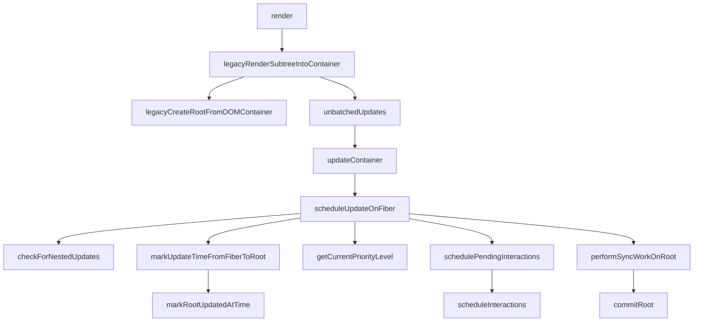

之前知道了首次渲染创建更新的过程，现在进入提交更新的过程（下图中的右侧部分）。

<!-- more -->



|  函数名     |   参数(类型)    |   位置    |
|  ---  |  ---  |  ---  |
|commitRoot|root|react-reconciler/src/ReactFiberWorkLoop|
|runWithPriority|reactPriorityLevel(ReactPriorityLevel), fn|react-reconciler/src/SchedulerWithReactIntegration|
|Scheduler_runWithPriority|priorityLevel(ReactPriorityLevel), eventHandler(fn)|scheduler/src/Scheduler|
|commitRootImpl|root, renderPriorityLevel|react-reconciler/src/ReactFiberWorkLoop|
|markRootFinishedAtTime|root(FiberRoot), finishedExpirationTime(ExpirationTime), remainingExpirationTime(ExpirationTime)|react-reconciler/src/ReactFiberRoot|
|commitBeforeMutationEffects|-|react-reconciler/src/ReactFiberWorkLoop|
|commitBeforeMutationLifeCycles|current(Fiber或bull), finishedWork(Fiber)|react-reconciler/src/ReactFiberWorkLoop|


---

### 主要函数

1. commitRoot

```js
  // Except for NoPriority, these correspond to Scheduler priorities. We use
  // ascending numbers so we can compare them like numbers. They start at 90 to
  // avoid clashing with Scheduler's priorities.
  export const ImmediatePriority: ReactPriorityLevel = 99;
  export const UserBlockingPriority: ReactPriorityLevel = 98;
  export const NormalPriority: ReactPriorityLevel = 97;
  export const LowPriority: ReactPriorityLevel = 96;
  export const IdlePriority: ReactPriorityLevel = 95;
  // NoPriority is the absence of priority. Also React-only.
  export const NoPriority: ReactPriorityLevel = 90;

  function commitRoot(root) {
    const renderPriorityLevel = getCurrentPriorityLevel(); // 此处返回的是NormalPriority 97
    runWithPriority(
      ImmediatePriority, // 这里值为99
      commitRootImpl.bind(null, root, renderPriorityLevel),
    );
    return null;
  }
```

2. runWithPriority

```js
function runWithPriority<T>(
  reactPriorityLevel: ReactPriorityLevel,
  fn: () => T,
): T {
  const priorityLevel = reactPriorityToSchedulerPriority(reactPriorityLevel); // 不明白这里为啥要对priority做转换 此处返回值为1
  return Scheduler_runWithPriority(priorityLevel, fn);
}
```

3. Scheduler_runWithPriority

```js
function unstable_runWithPriority(priorityLevel, eventHandler) {
  switch (priorityLevel) {
    case ImmediatePriority:
    case UserBlockingPriority:
    case NormalPriority:
    case LowPriority:
    case IdlePriority:
      break;
    default:
      priorityLevel = NormalPriority;
  }

  var previousPriorityLevel = currentPriorityLevel;
  currentPriorityLevel = priorityLevel;

  try {
    return eventHandler();
  } finally {
    currentPriorityLevel = previousPriorityLevel;
  }
}
```

4. commitRootImpl

```js
function commitRootImpl(root, renderPriorityLevel) {
  do {
    // `flushPassiveEffects` will call `flushSyncUpdateQueue` at the end, which
    // means `flushPassiveEffects` will sometimes result in additional
    // passive effects. So we need to keep flushing in a loop until there are
    // no more pending effects.
    // TODO: Might be better if `flushPassiveEffects` did not automatically
    // flush synchronous work at the end, to avoid factoring hazards like this.
    flushPassiveEffects();
  } while (rootWithPendingPassiveEffects !== null);
  flushRenderPhaseStrictModeWarningsInDEV();

  invariant(
    (executionContext & (RenderContext | CommitContext)) === NoContext,
    'Should not already be working.',
  );

  const finishedWork = root.finishedWork;
  const expirationTime = root.finishedExpirationTime;
  if (finishedWork === null) {
    return null;
  }
  root.finishedWork = null;
  root.finishedExpirationTime = NoWork;

  invariant(
    finishedWork !== root.current,
    'Cannot commit the same tree as before. This error is likely caused by ' +
      'a bug in React. Please file an issue.',
  );

  // commitRoot never returns a continuation; it always finishes synchronously.
  // So we can clear these now to allow a new callback to be scheduled.
  root.callbackNode = null;
  root.callbackExpirationTime = NoWork;
  root.callbackPriority_old = NoPriority;

  // Update the first and last pending times on this root. The new first
  // pending time is whatever is left on the root fiber.
  const remainingExpirationTimeBeforeCommit = getRemainingExpirationTime(
    finishedWork,
  );
  markRootFinishedAtTime(
    root,
    expirationTime,
    remainingExpirationTimeBeforeCommit,
  );

  // Clear already finished discrete updates in case that a later call of
  // `flushDiscreteUpdates` starts a useless render pass which may cancels
  // a scheduled timeout.
  if (rootsWithPendingDiscreteUpdates !== null) {
    const lastDiscreteTime = rootsWithPendingDiscreteUpdates.get(root);
    if (
      lastDiscreteTime !== undefined &&
      remainingExpirationTimeBeforeCommit < lastDiscreteTime
    ) {
      rootsWithPendingDiscreteUpdates.delete(root);
    }
  }

  if (root === workInProgressRoot) {
    // We can reset these now that they are finished.
    workInProgressRoot = null;
    workInProgress = null;
    renderExpirationTime = NoWork;
  } else {
    // This indicates that the last root we worked on is not the same one that
    // we're committing now. This most commonly happens when a suspended root
    // times out.
  }

  // Get the list of effects.
  let firstEffect;
  if (finishedWork.effectTag > PerformedWork) { // 256 > 1
    // A fiber's effect list consists only of its children, not itself. So if
    // the root has an effect, we need to add it to the end of the list. The
    // resulting list is the set that would belong to the root's parent, if it
    // had one; that is, all the effects in the tree including the root.
    if (finishedWork.lastEffect !== null) {
      finishedWork.lastEffect.nextEffect = finishedWork;
      firstEffect = finishedWork.firstEffect;
    } else {
      firstEffect = finishedWork;
    }
  } else {
    // There is no effect on the root.
    firstEffect = finishedWork.firstEffect;
  }

  if (firstEffect !== null) {
    const prevExecutionContext = executionContext;
    executionContext |= CommitContext;
    const prevInteractions = pushInteractions(root);

    // Reset this to null before calling lifecycles
    ReactCurrentOwner.current = null;

    // The commit phase is broken into several sub-phases. We do a separate pass
    // of the effect list for each phase: all mutation effects come before all
    // layout effects, and so on.

    // The first phase a "before mutation" phase. We use this phase to read the
    // state of the host tree right before we mutate it. This is where
    // getSnapshotBeforeUpdate is called.
    focusedInstanceHandle = prepareForCommit(root.containerInfo);
    shouldFireAfterActiveInstanceBlur = false;

    nextEffect = firstEffect; // 在此处设置了nextEffect
    do {
      try {
        // 感觉首次渲染，上面的代码并没有做什么有重大影响的操作
        commitBeforeMutationEffects();
      } catch (error) {
        invariant(nextEffect !== null, 'Should be working on an effect.');
        captureCommitPhaseError(nextEffect, error);
        nextEffect = nextEffect.nextEffect;
      }
    } while (nextEffect !== null);

    // We no longer need to track the active instance fiber
    focusedInstanceHandle = null;

    if (enableProfilerTimer) {
      // Mark the current commit time to be shared by all Profilers in this
      // batch. This enables them to be grouped later.
      recordCommitTime();
    }

    // The next phase is the mutation phase, where we mutate the host tree.
    nextEffect = firstEffect;
    do {
      try {
        commitMutationEffects(root, renderPriorityLevel);
      } catch (error) {
        invariant(nextEffect !== null, 'Should be working on an effect.');
        captureCommitPhaseError(nextEffect, error);
        nextEffect = nextEffect.nextEffect;
      }
    } while (nextEffect !== null);

    if (shouldFireAfterActiveInstanceBlur) {
      afterActiveInstanceBlur();
    }
    resetAfterCommit(root.containerInfo);

    // The work-in-progress tree is now the current tree. This must come after
    // the mutation phase, so that the previous tree is still current during
    // componentWillUnmount, but before the layout phase, so that the finished
    // work is current during componentDidMount/Update.
    root.current = finishedWork;

    // The next phase is the layout phase, where we call effects that read
    // the host tree after it's been mutated. The idiomatic use case for this is
    // layout, but class component lifecycles also fire here for legacy reasons.
    nextEffect = firstEffect;
    do {
      try {
        commitLayoutEffects(root, expirationTime);
      } catch (error) {
        invariant(nextEffect !== null, 'Should be working on an effect.');
        captureCommitPhaseError(nextEffect, error);
        nextEffect = nextEffect.nextEffect;
      }
    } while (nextEffect !== null);

    nextEffect = null;

    // Tell Scheduler to yield at the end of the frame, so the browser has an
    // opportunity to paint.
    requestPaint();

    if (enableSchedulerTracing) {
      popInteractions(((prevInteractions: any): Set<Interaction>));
    }
    executionContext = prevExecutionContext;
  } else {
    // No effects.
    root.current = finishedWork;
    // Measure these anyway so the flamegraph explicitly shows that there were
    // no effects.
    // TODO: Maybe there's a better way to report this.
    if (enableProfilerTimer) {
      recordCommitTime();
    }
  }

  const rootDidHavePassiveEffects = rootDoesHavePassiveEffects;

  if (rootDoesHavePassiveEffects) {
    // This commit has passive effects. Stash a reference to them. But don't
    // schedule a callback until after flushing layout work.
    rootDoesHavePassiveEffects = false;
    rootWithPendingPassiveEffects = root;
    pendingPassiveEffectsExpirationTime = expirationTime;
    pendingPassiveEffectsRenderPriority = renderPriorityLevel;
  } else {
    // We are done with the effect chain at this point so let's clear the
    // nextEffect pointers to assist with GC. If we have passive effects, we'll
    // clear this in flushPassiveEffects.
    nextEffect = firstEffect;
    while (nextEffect !== null) {
      const nextNextEffect = nextEffect.nextEffect;
      nextEffect.nextEffect = null;
      if (nextEffect.effectTag & Deletion) {
        detachFiberAfterEffects(nextEffect);
      }
      nextEffect = nextNextEffect;
    }
  }

  // Check if there's remaining work on this root
  const remainingExpirationTime = root.firstPendingTime;
  if (remainingExpirationTime !== NoWork) {
    if (enableSchedulerTracing) {
      if (spawnedWorkDuringRender !== null) {
        const expirationTimes = spawnedWorkDuringRender;
        spawnedWorkDuringRender = null;
        for (let i = 0; i < expirationTimes.length; i++) {
          scheduleInteractions(
            root,
            expirationTimes[i],
            root.memoizedInteractions,
          );
        }
      }
      schedulePendingInteractions(root, remainingExpirationTime);
    }
  } else {
    // If there's no remaining work, we can clear the set of already failed
    // error boundaries.
    legacyErrorBoundariesThatAlreadyFailed = null;
  }

  if (enableSchedulerTracing) {
    if (!rootDidHavePassiveEffects) {
      // If there are no passive effects, then we can complete the pending interactions.
      // Otherwise, we'll wait until after the passive effects are flushed.
      // Wait to do this until after remaining work has been scheduled,
      // so that we don't prematurely signal complete for interactions when there's e.g. hidden work.
      finishPendingInteractions(root, expirationTime);
    }
  }

  if (remainingExpirationTime === Sync) {
    // Count the number of times the root synchronously re-renders without
    // finishing. If there are too many, it indicates an infinite update loop.
    if (root === rootWithNestedUpdates) {
      nestedUpdateCount++;
    } else {
      nestedUpdateCount = 0;
      rootWithNestedUpdates = root;
    }
  } else {
    nestedUpdateCount = 0;
  }

  onCommitRootDevTools(finishedWork.stateNode, expirationTime);

  // Always call this before exiting `commitRoot`, to ensure that any
  // additional work on this root is scheduled.
  ensureRootIsScheduled(root);

  if (hasUncaughtError) {
    hasUncaughtError = false;
    const error = firstUncaughtError;
    firstUncaughtError = null;
    throw error;
  }

  if ((executionContext & LegacyUnbatchedContext) !== NoContext) {
    // This is a legacy edge case. We just committed the initial mount of
    // a ReactDOM.render-ed root inside of batchedUpdates. The commit fired
    // synchronously, but layout updates should be deferred until the end
    // of the batch.
    return null;
  }

  // If layout work was scheduled, flush it now.
  flushSyncCallbackQueue();

  return null;
}
```

5. markRootFinishedAtTime

这里又出来两个概念：

  - pending times
  - suspended times

```js
  export const PerformedWork = /*            */ 0b00000000000001;
  function markRootFinishedAtTime(
    root: FiberRoot,
    finishedExpirationTime: ExpirationTime,
    remainingExpirationTime: ExpirationTime,
  ): void {
    // Update the range of pending times
    root.firstPendingTime = remainingExpirationTime;
    if (remainingExpirationTime < root.lastPendingTime) {
      // This usually means we've finished all the work, but it can also happen
      // when something gets downprioritized during render, like a hidden tree.
      root.lastPendingTime = remainingExpirationTime;
    }

    // Update the range of suspended times. Treat everything higher priority or
    // equal to this update as unsuspended.
    if (finishedExpirationTime <= root.lastSuspendedTime) {
      // The entire suspended range is now unsuspended.
      root.firstSuspendedTime = root.lastSuspendedTime = root.nextKnownPendingLevel = NoWork;
    } else if (finishedExpirationTime <= root.firstSuspendedTime) {
      // Part of the suspended range is now unsuspended. Narrow the range to
      // include everything between the unsuspended time (non-inclusive) and the
      // last suspended time.
      root.firstSuspendedTime = finishedExpirationTime - 1;
    }

    if (finishedExpirationTime <= root.lastPingedTime) {
      // Clear the pinged time
      root.lastPingedTime = NoWork;
    }

    if (finishedExpirationTime <= root.lastExpiredTime) {
      // Clear the expired time
      root.lastExpiredTime = NoWork;
    }

    // Clear any pending updates that were just processed.
    clearPendingMutableSourceUpdates(root, finishedExpirationTime);
  }
```

6. commitBeforeMutationEffects

```js
// effectTag
export const Placement = /*                */ 0b00000000000010;
export const Update = /*                   */ 0b00000000000100;
export const PlacementAndUpdate = /*       */ 0b00000000000110;
export const Deletion = /*                 */ 0b00000000001000;
export const ContentReset = /*             */ 0b00000000010000;
export const Callback = /*                 */ 0b00000000100000;
export const DidCapture = /*               */ 0b00000001000000;
export const Ref = /*                      */ 0b00000010000000;
export const Snapshot = /*                 */ 0b00000100000000;
export const Passive = /*                  */ 0b00001000000000;
export const PassiveUnmountPendingDev = /* */ 0b10000000000000;
export const Hydrating = /*                */ 0b00010000000000;
export const HydratingAndUpdate = /*       */ 0b00010000000100;

function commitBeforeMutationEffects() {
  while (nextEffect !== null) {
    if (
      !shouldFireAfterActiveInstanceBlur &&
      focusedInstanceHandle !== null &&
      isFiberHiddenOrDeletedAndContains(nextEffect, focusedInstanceHandle)
    ) {
      shouldFireAfterActiveInstanceBlur = true;
      beforeActiveInstanceBlur();
    }
    const effectTag = nextEffect.effectTag; 
    if ((effectTag & Snapshot) !== NoEffect) {
      setCurrentDebugFiberInDEV(nextEffect);

      const current = nextEffect.alternate;
      commitBeforeMutationEffectOnFiber(current, nextEffect);

      resetCurrentDebugFiberInDEV();
    }
    if ((effectTag & Passive) !== NoEffect) {
      // If there are passive effects, schedule a callback to flush at
      // the earliest opportunity.
      if (!rootDoesHavePassiveEffects) {
        rootDoesHavePassiveEffects = true;
        scheduleCallback(NormalPriority, () => {
          flushPassiveEffects();
          return null;
        });
      }
    }
    nextEffect = nextEffect.nextEffect;
  }
}
```
感觉这里有点点奇怪诶，首次nextEffect是那个Strict组件，但它的nextEffect却指向其父集

7. commitBeforeMutationLifeCycles

```js
function commitBeforeMutationLifeCycles(
  current: Fiber | null,
  finishedWork: Fiber,
): void {
  switch (finishedWork.tag) {
    case FunctionComponent:
    case ForwardRef:
    case SimpleMemoComponent:
    case Block: {
      return;
    }
    case ClassComponent: {
      if (finishedWork.effectTag & Snapshot) {
        if (current !== null) {
          const prevProps = current.memoizedProps;
          const prevState = current.memoizedState;
          const instance = finishedWork.stateNode;
          const snapshot = instance.getSnapshotBeforeUpdate(
            finishedWork.elementType === finishedWork.type
              ? prevProps
              : resolveDefaultProps(finishedWork.type, prevProps),
            prevState,
          );
          instance.__reactInternalSnapshotBeforeUpdate = snapshot;
        }
      }
      return;
    }
    case HostRoot: {
      if (supportsMutation) {
        if (finishedWork.effectTag & Snapshot) {
          const root = finishedWork.stateNode;
          clearContainer(root.containerInfo);
        }
      }
      return;
    }
    case HostComponent:
    case HostText:
    case HostPortal:
    case IncompleteClassComponent:
      // Nothing to do for these component types
      return;
  }
  invariant(
    false,
    'This unit of work tag should not have side-effects. This error is ' +
      'likely caused by a bug in React. Please file an issue.',
  );
}
```

本函数此次执行最主要的任务就是清空根节点的内容


---

### 参考资料

1. https://reactjs.org/docs/react-component.html#getsnapshotbeforeupdate
2. https://developer.mozilla.org/en-US/docs/Web/API/DocumentOrShadowRoot/activeElement